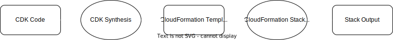
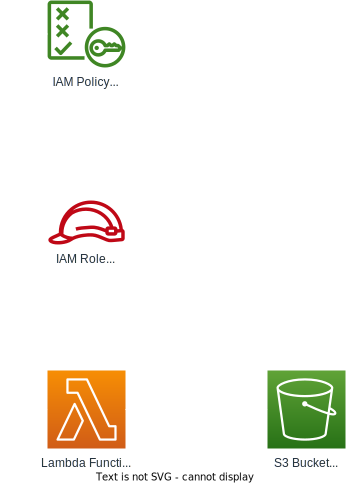

# AWS Fundamentals Workshop

## Introduction

Welcome to the AWS Fundamentals Workshop! This comprehensive guide is designed to provide you with a solid foundation in Amazon Web Services (AWS). Through a combination of theoretical concepts and hands-on labs, you'll gain practical experience with essential AWS services and best practices.

In this workshop, we'll be using AWS Cloud Development Kit (CDK), an open-source software development framework to define cloud infrastructure in code and provision it through AWS CloudFormation.

**Note on Costs**: While this workshop is designed to use AWS Free Tier resources where possible, some services may incur minor costs. Please review the AWS Free Tier terms and monitor your usage to avoid unexpected charges.

## How to Use This Guide

This workshop is structured into several labs, each focusing on a specific AWS service or concept. Each lab contains:

- An introduction to the topic
- Step-by-step instructions
- Hands-on exercises
- Additional resources for further learning

Navigate through the labs in order, as each builds upon the previous one. Use the sidebar to move between sections.

## Target Audience

This workshop is ideal for:

- Developers new to AWS
- IT professionals looking to expand their cloud skills
- Anyone interested in learning how to deploy and manage AWS resources programmatically

## Prerequisites

- Basic understanding of programming concepts (TypeScript will be used for CDK)
- Familiarity with command-line interfaces
- AWS account (free tier is sufficient for this workshop)
- Node.js (version 12 or later) installed
- AWS CLI version 2 installed and configured

## Project Overview

The purpose of this workshop is to provide a foundational understanding of AWS services and to guide participants through hands-on labs that will solidify their learning. We will cover essential AWS services, key concepts, and best practices, ensuring that you have the knowledge and skills required to effectively utilize AWS for various projects.

## Workshop Architecture Evolution

Throughout this workshop, we'll build our architecture in stages. This incremental approach allows you to understand each component individually before combining them into a more complex system:

1. **Initial Setup**: A basic CDK project with a CloudFormation output.

   

2. **IAM Basics**: A simple example using Lambda and S3 to explore IAM concepts.

   

3. **Networking**: Building a network to use for labs 4 and 5.

   

4. **Core Services**: Adding EC2, security, and S3 with bucket policy.

   

5. **RDS**: A complete setup incorporating networking, core services, and database.

   

### Core Concepts

#### 1. Overview of AWS

- **Introduction to AWS and project overview**
- **Key concepts and terminology**
- **Benefits of using AWS**

#### 2. Global AWS Infrastructure

- **Detailed look at AWS regions and availability zones**
- **Understanding edge locations and AWS Global Accelerator**

#### 3. Cloud Computing Models (IaaS, PaaS, SaaS)

- **Understanding the different cloud computing models**
- **Use cases and examples for IaaS, PaaS, and SaaS**

### Labs

#### 1. Introduction to AWS CDK

- **Overview of AWS CDK**
- **Setting up the AWS CDK environment**
- **Basic concepts: stacks, constructs, and apps**
- **Hands-On: Set up the initial project environment using CDK**
  - Install AWS CDK and set up a new CDK project
  - Create a basic stack

#### 2. Identity and Access Management (IAM)

- **Introduction to IAM**
- **More details on IAM best practices and security implications**
- **Best practices for managing IAM**
- **Hands-On: Set up IAM roles and policies using CDK**
  - Create IAM roles and policies

#### 3. Networking and Security Groups

- **Overview of Networking and Security**
- **Setting up a VPC for the project using CDK**
- **Configuring security groups and network ACLs**
- **Hands-On: Set up VPC and security groups using CDK**
  - Define a VPC with subnets and route tables
  - Configure security groups for the EC2 and RDS instances

#### 4. Basic AWS Services

- **Introduction to core services (EC2, S3, RDS, etc.)**
- **Understanding the AWS Management Console and CLI**
- **Hands-On: Deploy basic services using CDK**
  - Use CDK to create an S3 bucket and an EC2 instance

#### 5. Amazon RDS

- **Introduction to Amazon RDS**
- **Choosing the right RDS instance type for your application**
- **Configuring and managing RDS instances**
- **Best practices for RDS performance and cost optimization**
- **Hands-On: Set up RDS for relational data storage using CDK**
  - Create an RDS instance with CDK
  - Configure database parameters and settings

## Workshop Duration

Total estimated time: 4-8 hours

This is a self-paced workshop. The time ranges provided for each lab are estimates, and you should feel free to spend more time on areas you find challenging or interesting. Remember to take breaks as needed.

- Lab 1: 30-60 minutes
- Lab 2: 45-75 minutes
- Lab 3: 45-90 minutes
- Lab 4: 45-90 minutes
- Lab 5: 45-90 minutes

Note: Actual duration may vary based on individual pace and prior experience.

## Conclusion

By the end of this workshop, you will have gained practical experience with AWS services and be well-equipped to start building your own cloud solutions. Remember to clean up your resources after completing the labs to avoid unnecessary charges.

### Next Steps

To continue your AWS learning journey:

1. Explore the AWS documentation for services covered in this workshop
2. Try applying these concepts to your own projects
3. Consider pursuing AWS certifications, starting with the AWS Certified Cloud Practitioner

Enjoy your journey into AWS!
