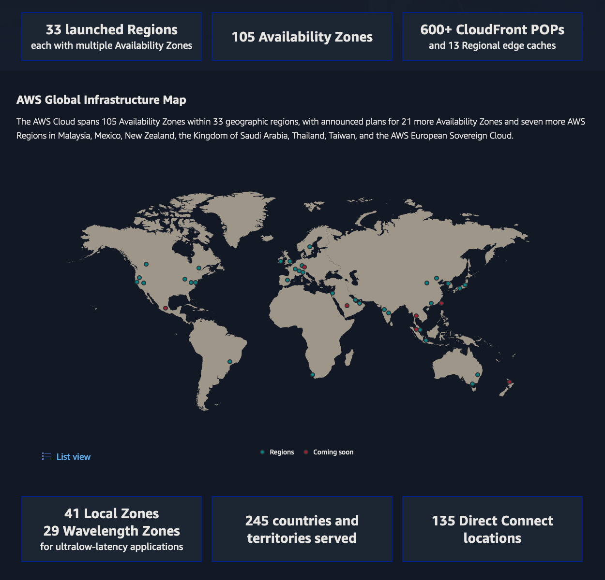

# Core Concepts

## 1. Overview of AWS

**Introduction to AWS**

Amazon Web Services (AWS) is a comprehensive and widely adopted cloud platform, offering over 200 fully featured services from data centers globally. AWS provides a variety of infrastructure services such as computing power, storage options, and networking, which are delivered as a utility—on-demand and available within seconds, with a pay-as-you-go pricing model. This model allows businesses of all sizes to access advanced technology without the need for significant upfront investment, thus democratizing access to high-performance computing resources.

To provide a visual overview of AWS, here's a helpful introductory video:

<iframe width="560" height="315" src="https://www.youtube.com/embed/a9__D53WsUs" title="YouTube video player" frameborder="0" allow="accelerometer; autoplay; clipboard-write; encrypted-media; gyroscope; picture-in-picture" allowfullscreen></iframe>

This video offers a concise introduction to AWS, its services, and how it can benefit businesses of all sizes. It's an excellent starting point for understanding the basics of AWS before diving deeper into specific concepts and services.

### Key Concepts and Terminology

To navigate the AWS ecosystem effectively, it is crucial to understand some core concepts and terminology:

- **Regions**: AWS infrastructure is organized into regions, which are geographic areas that host multiple data centers. Each region is isolated from the others to ensure fault tolerance and stability.
- **Availability Zones (AZs)**: Within each region, there are multiple Availability Zones, which are distinct locations engineered to be isolated from failures in other AZs. This allows for high availability and redundancy.
- **Edge Locations**: These are sites that AWS CloudFront uses to cache copies of your content closer to your users, thereby reducing latency and improving performance.
- **Elasticity**: This refers to the ability of AWS services to automatically increase or decrease resources as needed to meet demand, ensuring that applications can handle varying loads efficiently.
- **Scalability**: Scalability is the capability of AWS services to grow in size, volume, or number of users while maintaining performance. This is essential for businesses that need to scale their operations seamlessly.
- **EC2 (Elastic Compute Cloud)**: A core AWS service that provides resizable compute capacity in the cloud, allowing users to run virtual servers for various workloads.

### Benefits of Using AWS

Amazon Web Services (AWS) offers a multitude of advantages, making it the preferred choice for many organizations seeking a robust, scalable, and cost-effective cloud platform.

1. **Cost-Effective and Efficient Resource Management**: AWS's pay-as-you-go pricing model ensures that you only pay for what you use, without the need for significant upfront or long-term commitments. This flexibility leads to substantial cost savings by trading fixed expenses for variable expenses. Instead of investing heavily in data centers and servers before knowing how you'll use them, you pay only when you consume computing resources. This eliminates the need to guess infrastructure capacity needs, avoiding the pitfalls of either sitting on expensive idle resources or dealing with limited capacity. AWS allows you to access as much or as little capacity as needed, scaling up and down with only a few minutes' notice. Additionally, by outsourcing the racking, stacking, and powering of servers to AWS, you can focus on projects that differentiate your business and direct your efforts towards your own customers and core business activities, enhancing overall productivity and innovation.

2. **Benefit from Massive Economies of Scale**: By using cloud computing, you can achieve a lower variable cost than on your own. AWS aggregates usage from hundreds of thousands of customers, enabling it to achieve higher economies of scale, translating into lower pay-as-you-go prices. This collective advantage allows businesses of all sizes to benefit from reduced costs and improved efficiency.

3. **Increase Speed and Agility**: In a cloud computing environment, new IT resources are only a click away, reducing the time to make those resources available from weeks to just minutes. This dramatic increase in agility enables organizations to experiment and develop at a significantly lower cost and time. The ease of accessing and deploying resources quickly fosters innovation and accelerates time-to-market for new projects.

4. **Secure**: AWS implements a comprehensive security approach that includes physical, operational, and software measures to protect infrastructure and data. AWS's security practices are designed to comply with industry standards and certifications, providing a robust security framework that helps safeguard your applications and data.

5. **Flexible**: AWS supports a wide range of programming models, operating systems, databases, and architectures. This flexibility allows businesses to use the tools and technologies they are already familiar with, facilitating a smoother transition to the cloud. Whether you're running legacy applications or developing new ones, AWS provides the flexibility needed to meet diverse business requirements.

6. **Global Reach**: With AWS, you can deploy applications in multiple regions worldwide with just a few clicks. This global reach enables businesses to provide low-latency access to applications for users around the world, enhancing user experience and satisfaction. AWS's ability to go global in minutes allows businesses to expand their footprint and reach new markets efficiently.

By leveraging these advantages, AWS empowers organizations to innovate faster, reduce costs, and scale applications globally with ease, making it an essential platform for modern businesses.

## 2. Global AWS Infrastructure

**Detailed Look at AWS Regions and Availability Zones**

Amazon Web Services (AWS) operates its cloud infrastructure globally, organized into multiple geographic regions. Each AWS region is a separate geographic area that contains multiple data centers, known as Availability Zones (AZs). These regions are isolated from one another to ensure the highest level of fault tolerance and stability. Within each region, AZs are distinct locations engineered to be isolated from failures in other AZs, providing an added layer of redundancy.

Each AZ has independent power, cooling, and physical security, and they are interconnected through low-latency links. This setup allows businesses to architect highly available and fault-tolerant applications. For example, by deploying applications across multiple AZs within a region, you can ensure that if one AZ experiences an issue, the application can continue to operate from the other AZs without interruption. This multi-AZ deployment strategy is crucial for maintaining business continuity and delivering reliable user experiences.

AWS regions are strategically placed around the world to provide low-latency access to customers and to meet data residency requirements. As of now, AWS has dozens of regions globally, each with multiple AZs, ensuring that users can deploy applications close to their end-users, which improves performance and reduces latency.

In addition to Regions and Availability Zones, AWS also offers Local Zones and Wavelength Zones:

- **Local Zones**: These are extensions of AWS Regions, placed in densely populated areas to provide single-digit millisecond latency for specific applications.
- **Wavelength Zones**: These are infrastructure deployments embedded within telecommunications providers' data centers at the edge of the 5G network, enabling ultra-low latency applications.

**Understanding Edge Locations and AWS Global Accelerator**

In addition to regions and AZs, AWS has a network of edge locations that are crucial for content delivery and improving application performance. Edge locations are sites that AWS CloudFront, a content delivery network (CDN) service, uses to cache copies of your content closer to your users. By doing so, edge locations help reduce latency by serving content from the nearest location to the end-user, resulting in faster load times and a better user experience.

AWS also offers the AWS Global Accelerator service, which further enhances performance and availability for your applications. AWS Global Accelerator uses the AWS global network to optimize the path from your users to your applications, improving the performance of API's by up to 60%. It provides two static IP addresses that act as a fixed entry point to your application, regardless of changes in application endpoints or region failover scenarios. Global Accelerator automatically routes traffic to the nearest healthy endpoint based on health checks and predefined traffic policies, ensuring high availability and low latency.

By leveraging edge locations and AWS Global Accelerator, businesses can provide a seamless and responsive user experience worldwide. These services are particularly beneficial for applications that require real-time data processing, low-latency access, or need to maintain high availability even during regional outages.

Understanding the global AWS infrastructure, including regions, AZs, edge locations, and services like AWS Global Accelerator, is fundamental to architecting robust, scalable, and high-performing applications on AWS. These components collectively ensure that your applications can meet the demands of a global user base while maintaining reliability and performance.

## 3. Cloud Computing Models

### Understanding the Different Cloud Computing Models

Cloud computing has revolutionized how businesses manage their IT resources by providing scalable, on-demand access to computing power, storage, and applications over the internet. There are three primary models of cloud computing services: Infrastructure as a Service (IaaS), Platform as a Service (PaaS), and Software as a Service (SaaS). Each model offers different levels of control, flexibility, and management, catering to various business needs and use cases.

- **Infrastructure as a Service (IaaS)**: IaaS provides virtualized computing resources over the internet. With IaaS, businesses can rent infrastructure—such as servers, storage, and networking—on a pay-as-you-go basis. This model allows companies to avoid the expense and complexity of buying and managing physical servers and data center infrastructure. Amazon EC2 (Elastic Compute Cloud) is a prime example of IaaS, offering scalable compute capacity in the cloud. Users have control over the operating system, storage, and deployed applications, making it suitable for workloads that require fine-grained control and customization.
- **Platform as a Service (PaaS)**: PaaS provides a platform that allows developers to build, deploy, and manage applications without worrying about the underlying infrastructure. It offers a set of tools and services designed to make the development process more efficient. AWS Elastic Beanstalk is an example of PaaS, enabling developers to deploy and scale web applications and services. With PaaS, the provider manages the infrastructure, operating system, and middleware, allowing developers to focus solely on writing code and developing their applications.
- **Software as a Service (SaaS)**: SaaS delivers software applications over the internet on a subscription basis. These applications are hosted and managed by the service provider, eliminating the need for businesses to install and maintain software on their own servers. SaaS applications are accessible from any device with an internet connection, providing flexibility and ease of use. Examples of SaaS include Amazon WorkSpaces, a cloud-based virtual desktop service, and Amazon Chime, a communications service for online meetings and video conferencing. SaaS is ideal for applications that require web or mobile access and for businesses looking to offload the management and maintenance of software applications.

### Shared Responsibility Model

It's important to note that AWS operates on a Shared Responsibility Model. This model delineates the security responsibilities between AWS and the customer. AWS is responsible for the security "of" the cloud (infrastructure), while customers are responsible for security "in" the cloud (data, access management, etc.). Understanding this model is crucial for properly securing your AWS deployments across all computing models.

### Cloud Computing Models Comparison

| Model | Control | Flexibility | Management Overhead | Example AWS Services   |
| ----- | ------- | ----------- | ------------------- | ---------------------- |
| IaaS  | High    | High        | High                | EC2, EBS, VPC          |
| PaaS  | Medium  | Medium      | Medium              | Elastic Beanstalk, ECS |
| SaaS  | Low     | Low         | Low                 | WorkSpaces, Chime      |

### Use Cases and Examples for IaaS, PaaS, and SaaS

Understanding the appropriate use cases for each cloud computing model is crucial for leveraging their full potential:

- **IaaS Use Case**: A company looking to host a highly customized web application would benefit from using IaaS. For instance, a business that needs specific configurations for its web servers, database servers, and network setup can use Amazon EC2 to deploy virtual machines, configure security settings, and manage network resources. This level of control is essential for applications with unique requirements or those that need to integrate with legacy systems.
- **PaaS Use Case**: A software development team focusing on building and deploying a new web application can use AWS Elastic Beanstalk. This allows the team to upload their code, and Elastic Beanstalk automatically handles the deployment, from capacity provisioning, load balancing, and auto-scaling to application health monitoring. This model accelerates the development process, enabling developers to concentrate on writing code without worrying about infrastructure management.
- **SaaS Use Case**: An organization needing a reliable and scalable email service can utilize Amazon WorkMail, a managed email and calendaring service. With SaaS, the organization avoids the complexities of managing email servers, software updates, and security patches. Employees can access their email from any device, ensuring seamless communication and collaboration.

By understanding the different cloud computing models—Infrastructure as a Service (IaaS), Platform as a Service (PaaS), and Software as a Service (SaaS)—and their respective use cases, businesses can select the most appropriate model for their needs. This enables them to optimize costs, improve efficiency, and focus on their core competencies.

## AWS Pricing Models

AWS offers several pricing models:

- Pay-as-you-go: Pay only for the resources you use, with no long-term commitments.
- Savings Plans: Commit to a consistent amount of usage for a 1 or 3 year term in exchange for lower prices.
- Reserved Instances: Pre-pay for EC2 instances to receive significant discounts.
- Spot Instances: Bid on spare EC2 computing capacity for up to 90% off the on-demand price.

Always check the pricing page for each AWS service before using it in production.
