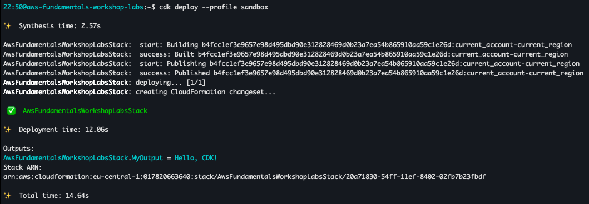

# Lab 1: Introduction to AWS CDK

This lab introduces you to AWS CDK (Cloud Development Kit) and guides you through setting up your initial project environment. You'll learn how to install the CDK toolkit, create a new project, and deploy a simple stack.

## Configure AWS Credentials with IAM Identity Center

Before you can use AWS CDK, you need to set up your AWS credentials. For this workshop, we'll assume you're using AWS IAM Identity Center (formerly AWS SSO) to access your AWS account. Follow these steps to configure your credentials:

If you're not using IAM Identity Center, you can find instructions for configuring standard IAM user credentials in the [AWS documentation](https://docs.aws.amazon.com/cdk/v2/guide/getting_started.html#getting_started_prerequisites).

1. **Install and Configure AWS CLI**:
   Ensure you have the AWS CLI version 2 installed. If not, download and install it from the [AWS CLI version 2 installation guide](https://docs.aws.amazon.com/cli/latest/userguide/install-cliv2.html).

2. **Configure AWS CLI with IAM Identity Center**:
   Run the following command and follow the prompts:

```bash
aws configure sso
```

You'll need to provide:

- SSO start URL (get this from your IT department)
- SSO Region (get this from your IT department)
- Default client Region
- Default output format (json is recommended)

Give the profile a name, and then you can issue commands using --profile PROFILE_NAME at the end.

Example:

```bash
aws s3 ls --profile sandbox
```

3. **Verify Setup**:
   To ensure everything is set up correctly, run:

```bash
aws sts get-caller-identity --profile PROFILE_NAME
```

This should display your AWS account ID, user ID, and ARN.

With these credentials set up, you're now ready to use AWS CDK with your company's AWS account.

## Set up the Initial Project Environment Using CDK

**Install AWS CDK and Set Up a New CDK Project**

To get started with AWS CDK, you need to install the AWS CDK Toolkit and set up a new CDK project. Follow these steps to set up your initial project environment:

1. **Install the AWS CDK Toolkit**:
   If you haven't already installed the AWS CDK Toolkit, you can do so using npm. Open your terminal and run the following command:

```bash
npm install -g aws-cdk
```

This command installs the CDK Toolkit globally on your machine, making the `cdk` command available from any directory.

To verify the installation, run:

```bash
cdk --version
```

This command installs the CDK Toolkit globally on your machine, making the `cdk` command available from any directory.

To verify the installation, run:

```bash
cdk --version
```

2. **Bootstrap your AWS account**:
   Before you can deploy CDK applications, you need to bootstrap your AWS account. This process creates the necessary resources in your account to support CDK deployments. Run the following command:

```bash
cdk bootstrap --profile PROFILE_NAME
```

This command sets up an S3 bucket and other resources needed for CDK deployments in your account.

3. **Create a New CDK Project**:
   Navigate to the directory where you want to create your new CDK project. We'll name our project `aws-fundamentals-workshop-labs`. Run the following commands to create a folder, navigate inside and initialize a new CDK application:

```bash
mkdir aws-fundamentals-workshop-labs
cd aws-fundamentals-workshop-labs
cdk init app --language=typescript
```

This command sets up a new CDK project with a basic directory structure and necessary configuration files.

4. **Create a New CDK Project**:
   Navigate to the directory where you want to create your new CDK project. We'll name our project `aws-fundamentals-workshop-labs`. Run the following commands to create a folder, navigate inside and initialize a new CDK application:

```bash
mkdir aws-fundamentals-workshop-labs
cd aws-fundamentals-workshop-labs
cdk init app --language=typescript
```

This command sets up a new CDK project with a basic directory structure and necessary configuration files.

## Lab Architecture

Before we proceed, let's take a look at the architecture we'll be building in this lab:


This diagram illustrates the key components of our lab:

1. A CDK application that defines our infrastructure as code.
2. A CloudFormation stack that will be generated from our CDK code.
3. A simple CloudFormation output that we'll create to verify our setup.

This basic architecture allows us to demonstrate the CDK deployment process and ensure our environment is correctly set up for the subsequent labs.

## Exploring the CDK Project Structure

After initializing your CDK project, let's take a quick tour of the files and directories created by the `cdk init app` command:

1. **`bin/` directory**:

   - Contains the entry point for your CDK application.
   - The main file (e.g., `aws-fundamentals-workshop-labs.ts` for TypeScript) defines the CDK app and instantiates the stack(s).

2. **`lib/` directory**:

   - Contains the stack definition(s) for your CDK application.
   - The main stack file (e.g., `aws-fundamentals-workshop-labs-stack.ts` for TypeScript) is where you'll define your AWS resources.

3. **`package.json`** (for TypeScript/JavaScript projects):

   - Defines project metadata and dependencies.
   - Contains scripts for building, testing, and deploying your CDK app.

4. **`cdk.json`**:

   - Tells the CDK Toolkit how to execute your app.
   - Specifies the app's entry point and other configuration options.

5. **`tsconfig.json`** (for TypeScript projects):

   - Contains TypeScript compiler configuration.

6. **`jest.config.js`** (if testing is set up):

   - Configuration file for Jest, the testing framework.

7. **`README.md`**:

   - Contains basic information about the project and how to use it.

8. **`.gitignore`**:
   - Specifies files and directories that Git should ignore.

This structure provides a solid foundation for developing your CDK application, with clear separation of concerns between the app definition, stack implementation, and project configuration.

## Create a Basic Stack with a CloudFormation Output

After setting up the project and configuring SSO, you can define your first stack. A stack in CDK is a collection of AWS resources that you manage as a single unit. Follow these steps to create a basic stack that outputs a simple message:

1. **Open the Stack File**:
   Open the stack file located in the `lib` directory. The stack file is named based on your project name, for example, `lib/aws-fundamentals-workshop-labs-stack.ts` for a TypeScript project.

2. **Define a CloudFormation Output**:
   Edit the stack file to define a CloudFormation output. First, delete the default comment and import at the top of the file. Then, add the CloudFormation output. Below is an example of a basic stack that creates a CloudFormation output using TypeScript:

```typescript
import { Stack, StackProps, CfnOutput } from 'aws-cdk-lib'
import { Construct } from 'constructs'

export class AwsFundamentalsWorkshopLabsStack extends Stack {
  constructor(scope: Construct, id: string, props?: StackProps) {
    super(scope, id, props)
    // Resources go here
    new CfnOutput(this, 'MyOutput', {
      value: 'Hello, CDK!',
      description: 'A simple CloudFormation output to prove the setup works',
    })
  }
}
```

3. **Deploy the Stack**:
   To deploy the stack to your AWS account, run the following command from the root directory of your CDK project:

```bash
cdk deploy --profile PROFILE_NAME
```

This command synthesizes the CloudFormation template from your CDK code and deploys the stack, creating the specified CloudFormation output in your account.

After the deployment is complete, you should see a success message in your terminal. Here's an example of what you might see:



Let's break down the information displayed in this output:

- **Synthesis time**: This is how long it took CDK to synthesize the CloudFormation template from your CDK code.
- **Building and Publishing**: These steps show CDK preparing and uploading assets (if any) to S3.
- **Deployment time**: This indicates how long it took to deploy your stack to AWS.
- **Outputs**: This section shows any outputs defined in your stack. In this case, we see our "Hello, CDK!" message.
- **Stack ARN**: This is the unique Amazon Resource Name (ARN) for your deployed CloudFormation stack.
- **Total time**: This is the overall time taken for the entire deploy process.

This output confirms that your stack was successfully deployed and provides key information about the deployment process and the resulting resources.

4. **Verify the Deployment**:
   After the deployment is complete, you can verify the CloudFormation output using the AWS Management Console:
   - Open the AWS Management Console.
   - Navigate to the CloudFormation service. (Type cfn in the search bar to quickly jump to it.)
   - Find and select the stack you just deployed.
   - In the stack details, go to the "Outputs" tab to see the output value "Hello, CDK!".

## Checkpoint

At this point, you should have:

- Installed the AWS CDK Toolkit
- Created a new CDK project
- Defined a basic stack with a CloudFormation output
- Successfully deployed the stack using `cdk deploy`
- Verified the output in the AWS CloudFormation console

If you're encountering issues, check the following:

- Ensure Node.js and npm are correctly installed and in your PATH
- Verify that you have the latest version of AWS CDK installed
- Check that your AWS credentials are properly configured
- Make sure you have the necessary permissions to create CloudFormation stacks

## Best Practices and Security Considerations

1. Regularly update your CDK version to benefit from the latest features and security improvements.
2. Use version control (like Git) to track changes to your CDK code.
3. Implement the principle of least privilege when defining IAM roles and policies.
4. Use CDK's built-in security checks to identify potential security issues in your infrastructure.

## Reset the Stack for the Next Lab

To ensure the environment is clean for the next lab, follow these steps to delete the stack and clean up your project:

1. **Delete the Stack**:
   To delete the stack from your AWS account, run the following command from the root directory of your CDK project:

```bash
cdk destroy --profile PROFILE_NAME
```

Confirm the deletion when prompted. This command removes all the resources defined in your stack from your AWS account.

2. **Clean Up the Stack File**:
   Open the stack file in the `lib` directory and remove the code you added. Your stack file should look like this after cleaning up:

```typescript
import { Stack, StackProps } from 'aws-cdk-lib'
import { Construct } from 'constructs'

export class AwsFundamentalsWorkshopLabsStack extends Stack {
  constructor(scope: Construct, id: string, props?: StackProps) {
    super(scope, id, props)

    // The stack is empty for the next lab
  }
}
```

Great work! You've set up your initial project environment using AWS CDK, deployed a basic stack, and cleaned up the environment for the next lab. This process has given you a strong starting point for building more complex cloud applications with AWS CDK.
