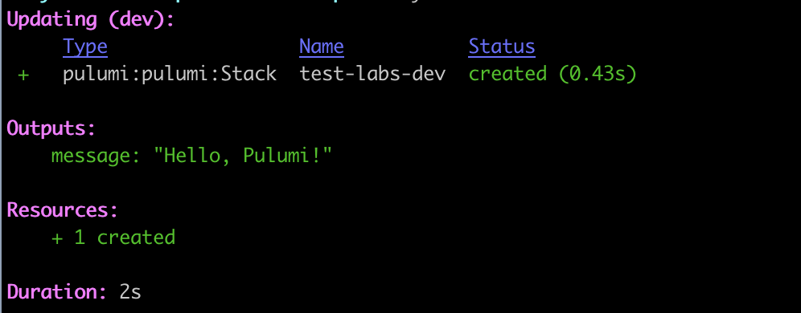

# Lab 1: Introduction to Pulumi

This lab introduces you to Pulumi and guides you through setting up your initial project environment. You'll learn how to install Pulumi, create a new project, and deploy a simple stack.

## Configure AWS Credentials with IAM Identity Center

Before you can use Pulumi, you need to set up your AWS credentials. For this workshop, we'll assume you're using AWS IAM Identity Center (formerly AWS SSO) to access your AWS account. Follow these steps to configure your credentials:

If you're not using IAM Identity Center, you can find instructions for configuring standard IAM user credentials in the [AWS documentation](https://docs.aws.amazon.com/cdk/v2/guide/getting_started.html#getting_started_prerequisites).

1. **Install and Configure AWS CLI**:
   Ensure you have the AWS CLI version 2 installed. If not, download and install it from the [AWS CLI version 2 installation guide](https://docs.aws.amazon.com/cli/latest/userguide/install-cliv2.html).

2. **Configure AWS CLI with IAM Identity Center**:
   Run the following command and follow the prompts:

```bash
aws configure sso
```

You'll need to provide:

- SSO start URL (get this from your IT department)
- SSO Region (get this from your IT department)
- Default client Region
- Default output format (json is recommended)

Give the profile a name, and then you can issue commands using --profile PROFILE_NAME at the end.

Example:

```bash
aws s3 ls --profile sandbox
```

3. **Verify Setup**:
   To ensure everything is set up correctly, run:

```bash
aws sts get-caller-identity --profile PROFILE_NAME
```

This should display your AWS account ID, user ID, and ARN.

With these credentials set up, you're now ready to use Pulumi with your company's AWS account.

## Set up the Initial Project Environment Using Pulumi

**Install Pulumi and Set Up a New Project**

To get started with Pulumi, you need to install Pulumi and set up a new project. Follow these steps:

1. **Install Pulumi**:
   Install Pulumi by following the [official installation guide](https://www.pulumi.com/docs/install/) for your operating system:

```bash
# macOS
brew install pulumi

# Windows
choco install pulumi

# Linux
curl -fsSL https://get.pulumi.com | sh
```

Verify the installation:

```bash
pulumi version
```


2. **Create the state backend**:
Go to the aws console and create a new s3 bucket which will be used as the state backend.

To do so, go to the AWS console, navigate to S3, click on "Create bucket", and follow the steps to create a new bucket (default settings are fine).

3. **Login to Pulumi**:
   You'll need to login to Pulumi to store your state.

```bash
pulumi login s3://YOUR_BUCKET_NAME
```

4. **Create a New Pulumi Project**:
   Navigate to where you want to create your project and run:

```bash
mkdir aws-fundamentals-workshop-labs
cd aws-fundamentals-workshop-labs
pulumi new aws-typescript
```

Follow the prompts to configure your project:
- Choose a project name
- Choose a project description
- Choose a stack name (dev is default)
- Passphrase to protect config/secrets (leave blank)
- Choose a package manager
- Choose the region

## Exploring the Pulumi Project Structure

After initializing your Pulumi project, let's explore the key files:

1. **`index.ts`**:
   - The main program file where you define your infrastructure
   - Contains your resource definitions and exports

2. **`package.json`**:
   - Defines project dependencies and scripts
   - Contains TypeScript and AWS SDK dependencies

3. **`Pulumi.yaml`**:
   - The project configuration file
   - Defines project settings, runtime and metadata (name, description, etc.)

4. **`Pulumi.dev.yaml`**:
   - Stack-specific configuration
   - Contains environment-specific settings

5. **`tsconfig.json`**:
   - TypeScript configuration file

## Create a simple output

1. **Edit the Main Program File**:
   Replace the contents of `index.ts` with:

```typescript:index.ts
import * as pulumi from "@pulumi/pulumi";

// Create a stack output
export const message = "Hello, Pulumi!";
```

2. **Deploy the Stack**:
   Deploy your stack using:

```bash
pulumi up
```

You'll see a preview of the changes and be prompted to confirm. After deployment, you'll see output similar to:



3. **Verify the Output**:
   You can view your stack's outputs using:

```bash
pulumi stack output
```

## Checkpoint

At this point, you should have:
- Installed Pulumi
- Created a new Pulumi project
- Defined a basic stack with an output
- Successfully deployed using `pulumi up`
- Verified the output

## Best Practices and Security Considerations

1. Use Pulumi's built-in secret management for sensitive values (e.g. use a kms key to encrypt secret values by [changing the secrets provider](https://www.pulumi.com/docs/iac/cli/commands/pulumi_stack_change-secrets-provider/) and [adding a secret value](https://www.pulumi.com/docs/iac/concepts/secrets/).
2. Follow the principle of least privilege for AWS credentials
3. Use version control for your infrastructure code

## Reset the Stack for the Next Lab

To clean up:

1. **Destroy the Stack**:
```bash
pulumi destroy
```

2. **Clean Up the Program File**:
   Reset `index.ts` to a clean state:

```typescript:index.ts
import * as pulumi from "@pulumi/pulumi";
import * as aws from "@pulumi/aws";

// The stack is empty for the next lab
```

Great work! You've set up your initial project environment using Pulumi, deployed a basic project, and cleaned up the environment for the next lab.
