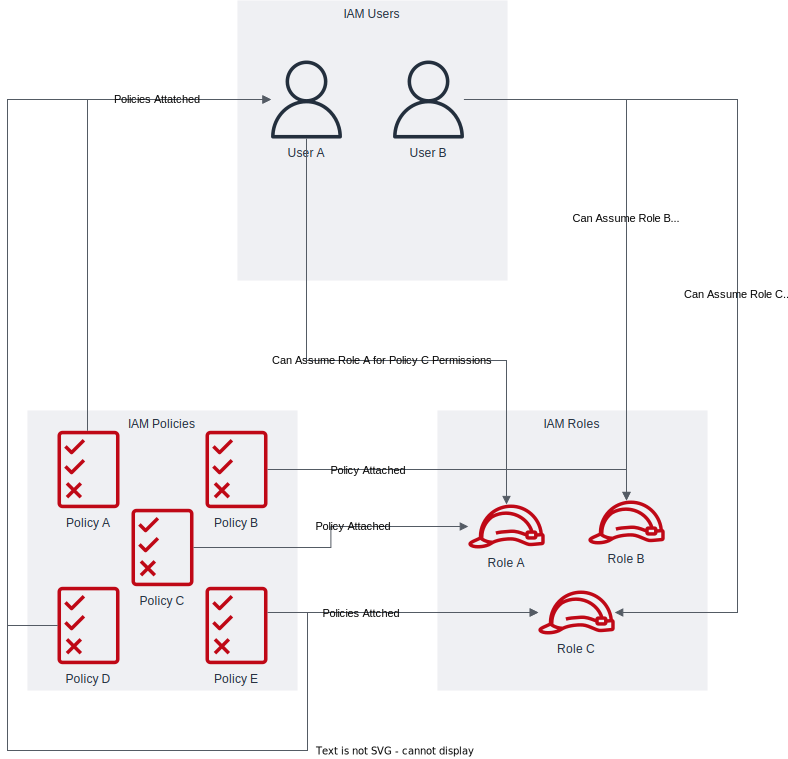
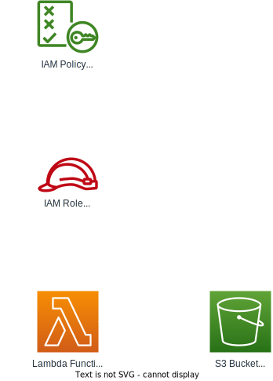
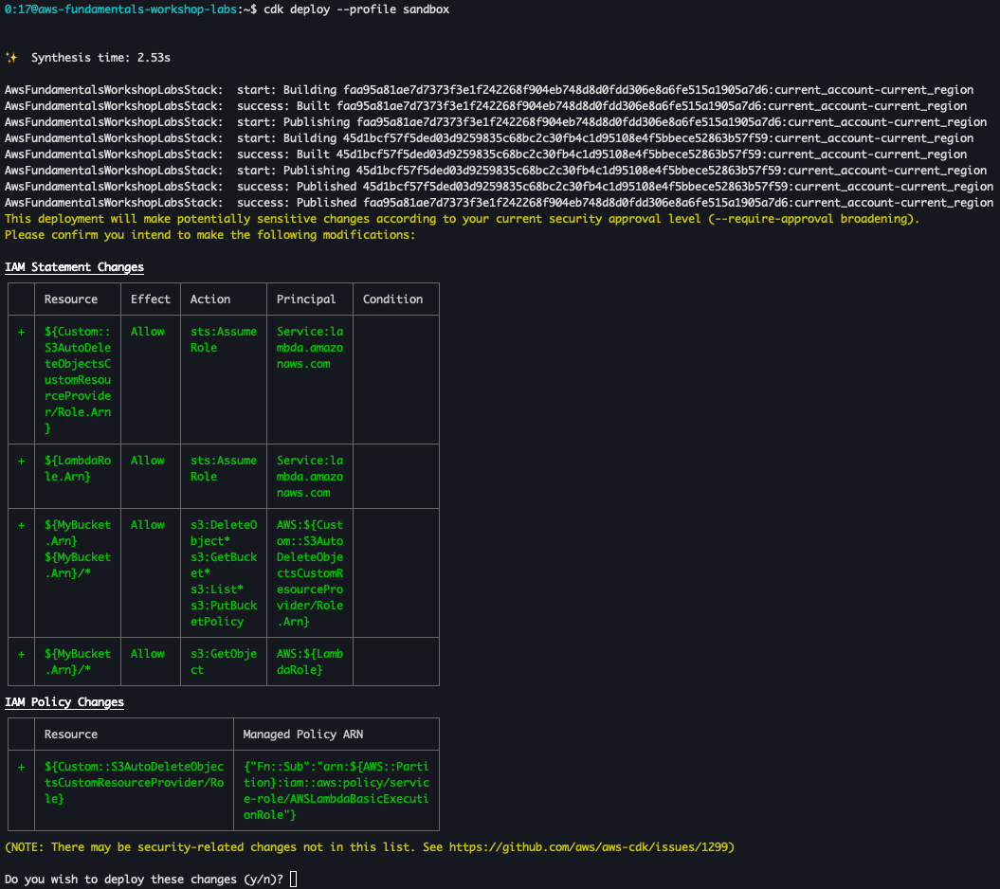

# Lab 2: Identity and Access Management (IAM)

## Introduction to IAM

AWS Identity and Access Management (IAM) is a web service that helps you securely control access to AWS resources. With IAM, you can centrally manage users, security credentials such as access keys, and permissions that control which AWS resources users and applications can access.

## Set up IAM Roles and Policies Using CDK

In this hands-on section, you will create an S3 bucket with a destroy policy, a Lambda function that writes a "Hello World" file to the bucket, and IAM roles and policies to manage permissions. This exercise will guide you through defining IAM roles and policies in code, deploying them to your AWS account, and verifying the setup.

**What is Amazon S3?**

Amazon Simple Storage Service (Amazon S3) is an object storage service that offers industry-leading scalability, data availability, security, and performance. Customers of all sizes and industries can use S3 to store and protect any amount of data for a range of use cases, such as websites, mobile applications, backup and restore, archive, enterprise applications, IoT devices, and big data analytics.

**What is AWS Lambda?**

AWS Lambda is a serverless compute service that lets you run code without provisioning or managing servers. Lambda runs your code only when needed and scales automatically, from a few requests per day to thousands per second. You can use Lambda to run code for virtually any type of application or backend service, all with zero administration.

## Principle of Least Privilege

The principle of least privilege is a fundamental concept in security that states that a user, program, or process should have only the bare minimum privileges necessary to perform its function. In the context of IAM, this means granting only the permissions required for a specific task or role, and nothing more. This practice helps to minimize the potential damage from errors or malicious actions.

## IAM Components Relationship



#### Components

1. **IAM Users**:

   - Represent individuals or applications that need access to AWS resources.
   - Users can have direct policies attached to define their permissions.
   - Examples in the diagram: User A, User B.

2. **IAM Roles**:

   - Define a set of permissions that can be assumed by trusted entities (IAM users, AWS services, or applications).
   - Roles facilitate the granting of temporary permissions to users or services.
   - Examples in the diagram: Role A, Role B.

3. **IAM Policies**:
   - JSON documents that specify permissions, detailing what actions are allowed or denied on which resources.
   - Policies can be attached to both users and roles to grant the necessary permissions.
   - Examples in the diagram: Policy 1, Policy 2.

#### Relationships

1. **Users to Policies**:

   - Users can have policies directly attached to them, specifying their permissions.
   - This relationship is represented by arrows connecting IAM Users to IAM Policies.
   - Indicates that User A and User B can perform actions defined in their attached policies.

2. **Roles to Policies**:

   - Roles can have policies directly attached to them, specifying the permissions for entities assuming the role.
   - This relationship is represented by arrows connecting IAM Roles to IAM Policies.
   - Indicates that Role A and Role B can perform actions defined in their attached policies.

3. **Users to Roles**:
   - Users can assume roles, temporarily inheriting the permissions defined by the roles.
   - This relationship is represented by arrows connecting IAM Users to IAM Roles.
   - Indicates that User A and User B can assume Role A or Role B, gaining the associated permissions.

## Lab Architecture

Before we dive into creating IAM roles, policies, and resources, let's take a look at the architecture we'll be building in this lab:



This diagram illustrates the key components of our lab:

1. An S3 bucket where we'll store our "Hello World" file.
2. A Lambda function that will attempt to write to the S3 bucket.
3. IAM roles and policies that will control the permissions between the Lambda function and the S3 bucket.

We'll start by creating these resources with incorrect permissions, then we'll fix them to demonstrate the importance of proper IAM configuration.

## Create IAM Roles, Policies, and Resources

1. **Create an S3 Bucket and Lambda Function with Incorrect Permissions**

   Open the stack file located in the `lib` directory (e.g., `lib/my-cdk-app-stack.ts` for a TypeScript project). Add the following code:

```typescript
import { CfnOutput, RemovalPolicy, Stack, StackProps } from 'aws-cdk-lib'
import {
  Policy,
  PolicyStatement,
  Role,
  ServicePrincipal,
} from 'aws-cdk-lib/aws-iam'
import { Code, Function, Runtime } from 'aws-cdk-lib/aws-lambda'
import { Bucket } from 'aws-cdk-lib/aws-s3'
import { Construct } from 'constructs'

export class AwsFundamentalsWorkshopLabsStack extends Stack {
  constructor(scope: Construct, id: string, props?: StackProps) {
    super(scope, id, props)

    // Create an S3 bucket with a destroy policy
    const bucket = new Bucket(this, 'MyBucket', {
      removalPolicy: RemovalPolicy.DESTROY,
      autoDeleteObjects: true,
    })

    // Define an IAM Role for Lambda
    const lambdaRole = new Role(this, 'LambdaRole', {
      assumedBy: new ServicePrincipal('lambda.amazonaws.com'),
    })

    // Incorrect IAM Policy (missing s3:PutObject permission)
    const incorrectPolicy = new Policy(this, 'IncorrectPolicy', {
      statements: [
        new PolicyStatement({
          actions: ['s3:GetObject'],
          resources: [bucket.bucketArn + '/*'],
        }),
      ],
    })

    // Attach the incorrect policy to the Lambda role
    lambdaRole.attachInlinePolicy(incorrectPolicy)

    // Create a Lambda function with inline code
    const lambdaFunction = new Function(this, 'MyLambda', {
      runtime: Runtime.NODEJS_LATEST,
      handler: 'index.handler',
      code: Code.fromInline(`
        const { S3Client, PutObjectCommand } = require('@aws-sdk/client-s3');
        const s3Client = new S3Client();

        exports.handler = async function(event) {
          const params = {
            Bucket: process.env.BUCKET_NAME,
            Key: 'hello.txt',
            Body: 'Hello World',
            ContentType: 'text/plain'
          };
          try {
            await s3Client.send(new PutObjectCommand(params));
            return {
              statusCode: 200,
              body: 'File written!'
            };
          } catch (error) {
            console.error('Error:', error);
            return {
              statusCode: 500,
              body: 'Error writing file'
            };
          }
        }
      `),
      environment: {
        BUCKET_NAME: bucket.bucketName,
      },
      role: lambdaRole,
    })

    // Output the Lambda function name
    new CfnOutput(this, 'LambdaFunctionName', {
      value: lambdaFunction.functionName,
    })

    // Output the bucket name
    new CfnOutput(this, 'BucketName', {
      value: bucket.bucketName,
    })

    // Output the Lambda function ARN
    new CfnOutput(this, 'LambdaArn', {
      value: lambdaFunction.functionArn,
    })
  }
}
```

2. **Deploy the Stack with Incorrect Permissions**

   Deploy the stack:

```bash
cdk deploy --profile PROFILE_NAME
```



When deploying a CDK stack that includes IAM resources, CDK will prompt for confirmation before making potentially sensitive changes. This is a security feature to prevent unintended modifications to IAM permissions. The image above shows an example of this confirmation prompt.

In this prompt, CDK provides a detailed breakdown of the IAM changes that will be made:

1. IAM Statement Changes: This section shows the new permissions that will be added, including which services can assume roles and what actions are allowed on which resources.

2. IAM Policy Changes: This part lists any managed policies that will be attached to IAM roles.

CDK requires explicit approval for these changes due to their potential security implications. This gives you an opportunity to review the permissions before they are applied, ensuring that you're not inadvertently granting more access than intended.

Always carefully review these changes before confirming. If you're unsure about any of the permissions being granted, it's best to double-check your CDK code or consult with your team before proceeding.

This deployment will succeed, but the Lambda function doesn't have the necessary `s3:PutObject` permission to write to the S3 bucket. To see this in action, we need to manually invoke the Lambda function:

3. **Manually Invoke the Lambda Function**

   To manually invoke the Lambda function using the AWS CLI and observe the permission issue, follow these steps:

   a. Open your terminal or command prompt.

   b. Use the following AWS CLI command to invoke the Lambda function:

```bash
aws lambda invoke \
    --function-name FUNCTION_NAME \
    --payload '{}' \
    --cli-binary-format raw-in-base64-out \
    --profile PROFILE_NAME \
    --query 'Payload' \
    --output text \
    /dev/stdout
```

Replace `FUNCTION_NAME` with the name or ARN of your Lambda function. You can find this in the AWS CloudFormation Console or from the CDK output. Don't forget to also replace `PROFILE_NAME` with your profile.

c. Check the terminal for the function's response. You should see an error message indicating a 500 error for the S3 PutObject action. `"Error writing file"`

This error occurs because the Lambda function is trying to write to the S3 bucket, but the current IAM policy only allows reading from the bucket, not writing to it.

1. **Update the IAM Policy with Correct Permissions**

   Update the stack file to correct the IAM policy by adding the `s3:PutObject` permission:

```typescript
// Correct IAM Policy
const correctPolicy = new Policy(this, 'CorrectPolicy', {
  statements: [
    new PolicyStatement({
      actions: ['s3:GetObject', 's3:PutObject'],
      resources: [bucket.bucketArn + '/*'],
    }),
  ],
})

// Attach the correct policy to the Lambda role
lambdaRole.attachInlinePolicy(correctPolicy)
```

5. **Deploy the Stack with Correct Permissions**

Deploy the stack again with the correct permissions:

```bash
cdk deploy --profile PROFILE_NAME
```

This deployment will update permissions as you'll see in your terminal, enter `y` to confirm the changes, and the Lambda function will now have the necessary permissions to write the "Hello World" file to the S3 bucket. To verify this, let's invoke the Lambda function again:

a. Use the AWS CLI command to invoke the Lambda function:

```bash
aws lambda invoke \
    --function-name FUNCTION_NAME \
    --payload '{}' \
    --cli-binary-format raw-in-base64-out \
    --profile PROFILE_NAME \
    --query 'Payload' \
    --output text \
    /dev/stdout
```

Replace `FUNCTION_NAME` with the name or ARN of your Lambda function and `PROFILE_NAME` with your profile. You can find the function name in the AWS CloudFormation Console or from the CDK output.

Now you should see a 200 message: `"File written!"`

6. **Verify the Deployment**

   To verify the deployment:

   - Open the AWS Management Console.
   - Navigate to the S3 service and find the bucket created by the stack.
   - Check the bucket contents for a file named `hello.txt` with the content "Hello World".

## Best Practices and Security Considerations

1. Follow the principle of least privilege when assigning permissions.
2. Use IAM roles for applications running on EC2 instances instead of IAM users.
3. Regularly rotate IAM access keys and require strong passwords.
4. Enable multi-factor authentication (MFA) for all IAM users, especially those with elevated privileges.
5. Use IAM Access Analyzer to identify resources in your organization that are shared with external entities.

## Checkpoint

At this point, you should have:

- Created an IAM role for Lambda
- Defined an IAM policy allowing access to S3
- Attached the policy to the IAM role
- Created a Lambda function that assumes this role
- Verified that the Lambda function can access the S3 bucket

If you're encountering issues, check the following:

- Review the IAM policy to ensure it grants the correct permissions
- Verify that the trust relationship on the IAM role allows Lambda to assume it
- Check the Lambda function's execution role to make sure it's using the correct IAM role
- Ensure the S3 bucket exists and you have the correct bucket name in your code

## Reset the Stack for the Next Lab

To ensure the environment is clean for the next lab, follow these steps to delete the stack and clean up your project:

1. **Delete the Stack**:
   To delete the stack from your AWS account, run the following command from the root directory of your CDK project:

```bash
cdk destroy --profile PROFILE_NAME
```

Confirm the deletion when prompted. This command removes all the resources defined in your stack from your AWS account.

2. **Clean Up the Stack File**:
   Open the stack file in the `lib` directory and remove the code you added. Your stack file should look like this after cleaning up:

```typescript
import { Stack, StackProps } from 'aws-cdk-lib'
import { Construct } from 'constructs'

export class AwsFundamentalsWorkshopLabsStack extends Stack {
  constructor(scope: Construct, id: string, props?: StackProps) {
    super(scope, id, props)

    // Stack is empty for the next lab
  }
}
```

Well done! You've navigated through creating and managing IAM roles and policies using AWS CDK, explored how permissions affect resource access, and confirmed the setup by writing a file to an S3 bucket with a Lambda function. Your environment is now prepared for the next lab.
