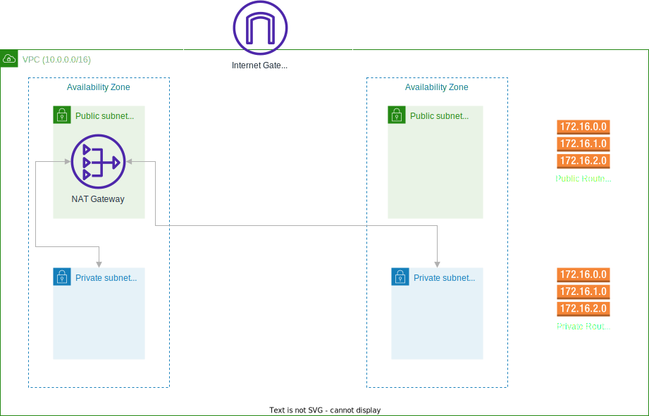

# Lab 3: Networking and Security Groups

## Set up VPC and Security Groups Using CDK

In this hands-on section, you will learn how to set up a Virtual Private Cloud (VPC) with subnets and route tables, and configure security groups using the AWS Cloud Development Kit (CDK). This exercise will guide you through defining network infrastructure and security settings in code and deploying them to your AWS account. Additionally, you will learn to use AWS Systems Manager Session Manager for secure instance access, avoiding the need for open SSH ports.

## Define a VPC with Subnets and Route Tables

1. **Open Your CDK Project**

   Navigate to your existing CDK project directory.

2. **Define the VPC in Your Stack**

   Open the stack file located in the `lib` directory (e.g., `lib/my-cdk-app-stack.ts` for a TypeScript project). Add the following code to define a VPC with public and private subnets ([it will only use two AZs as our CDK stack is environment agnostic.](https://docs.aws.amazon.com/cdk/api/v2/docs/aws-cdk-lib.aws_ec2.Vpc.html#maxazs)):

```typescript
import { CfnOutput, Stack, StackProps } from 'aws-cdk-lib'
import { SubnetType, Vpc } from 'aws-cdk-lib/aws-ec2'
import { Construct } from 'constructs'

export class AwsFundamentalsWorkshopLabsStack extends Stack {
  constructor(scope: Construct, id: string, props?: StackProps) {
    super(scope, id, props)

    // Create a VPC
    const vpc = new Vpc(this, 'MyVpc', {
      natGateways: 1, // Default is one in each AZ, this creates only one instead of two.
      subnetConfiguration: [
        {
          cidrMask: 24,
          name: 'public',
          subnetType: SubnetType.PUBLIC,
        },
        {
          cidrMask: 24,
          name: 'private',
          subnetType: SubnetType.PRIVATE_WITH_EGRESS, // This creates a private subnet with egress access to the internet.
        },
      ],
    })

    // Output the VPC ID
    new CfnOutput(this, 'VpcId', {
      value: vpc.vpcId,
    })
  }
}
```

> **Important:** Unlike the previous labs, we will be extending this stack in the following labs. It's crucial to keep this code as is before moving on to the next lab. This will serve as the foundation for our upcoming work with AWS services.

This code sets up a VPC with both public and private subnets, configured with a NAT Gateway for internet access from private subnets.

## Understanding CIDR Blocks in VPC Configuration

In the VPC configuration, we use CIDR blocks to define the IP address ranges for our subnets:

- The VPC uses a CIDR block of /16, which provides 65,536 available IP addresses.
- Public and private subnets use /24 CIDR blocks, each providing 256 IP addresses.

This configuration allows for efficient IP address allocation while maintaining a clear separation between public and private resources.

## Configure Security Groups

**Add Security Groups to Your Stack**

Extend the stack file to include security groups:

```typescript
import { CfnOutput, Stack, StackProps } from 'aws-cdk-lib'
import { SubnetType, Vpc, SecurityGroup, Peer, Port } from 'aws-cdk-lib/aws-ec2'
import { Construct } from 'constructs'

export class AwsFundamentalsWorkshopLabsStack extends Stack {
  constructor(scope: Construct, id: string, props?: StackProps) {
    super(scope, id, props)

    // Create a VPC
    const vpc = new Vpc(this, 'MyVpc', {
      natGateways: 1, // Default is one in each AZ, this creates only one instead of two.
      subnetConfiguration: [
        {
          cidrMask: 24,
          name: 'public',
          subnetType: SubnetType.PUBLIC,
        },
        {
          cidrMask: 24,
          name: 'private',
          subnetType: SubnetType.PRIVATE_WITH_EGRESS, // This creates a private subnet with egress access to the internet.
        },
      ],
    })

    // Security Group for EC2 instance
    const ec2SecurityGroup = new SecurityGroup(this, 'EC2SecurityGroup', {
      vpc,
      allowAllOutbound: true,
      description: 'Allow HTTP access to EC2 instance',
    })
    ec2SecurityGroup.addIngressRule(
      Peer.anyIpv4(),
      Port.tcp(80),
      'Allow HTTP access'
    )

    // Security Group for RDS instance
    const rdsSecurityGroup = new SecurityGroup(this, 'RDSSecurityGroup', {
      vpc,
      allowAllOutbound: true,
      description: 'Allow MySQL access to RDS instance',
    })
    rdsSecurityGroup.addIngressRule(
      ec2SecurityGroup,
      Port.tcp(3306),
      'Allow MySQL access from EC2 instance'
    )

    // Output the Security Group IDs
    new CfnOutput(this, 'EC2SecurityGroupId', {
      value: ec2SecurityGroup.securityGroupId,
    })
    new CfnOutput(this, 'RDSSecurityGroupId', {
      value: rdsSecurityGroup.securityGroupId,
    })

    // Output the VPC ID
    new CfnOutput(this, 'VpcId', {
      value: vpc.vpcId,
    })
  }
}
```

## Explanation of the Code

- **VPC**: Sets up a VPC with public and private subnets and a NAT Gateway.
- **EC2 Security Group**: Allows HTTP (port 80) access to the EC2 instance.
- **RDS Security Group**: Allows MySQL (port 3306) access from the EC2 security group.
- **Outputs**: Outputs the security group IDs for verification.

## Using AWS Systems Manager Session Manager

AWS Systems Manager Session Manager is a fully managed AWS service that provides secure and auditable instance management without needing to open inbound ports, manage bastion hosts, or manage SSH keys. It offers a browser-based shell and CLI access to your instances.

### Enabling Session Manager

To use Session Manager, ensure the following prerequisites are met:

1. **Install SSM Agent**: The SSM Agent must be installed and running on the EC2 instances. Most Amazon Machine Images (AMIs) have the SSM Agent pre-installed.
2. **IAM Role**: Your EC2 instances must have an IAM role with the necessary permissions to communicate with the Systems Manager service.

**Modify the CDK Stack to Attach IAM Role**

Extend the stack file to include an IAM role for the EC2 instance:

```typescript
import { CfnOutput, Stack, StackProps } from 'aws-cdk-lib'
import { SubnetType, Vpc, SecurityGroup, Peer, Port } from 'aws-cdk-lib/aws-ec2'
import { ManagedPolicy, Role, ServicePrincipal } from 'aws-cdk-lib/aws-iam'
import { Construct } from 'constructs'

export class AwsFundamentalsWorkshopLabsStack extends Stack {
  constructor(scope: Construct, id: string, props?: StackProps) {
    super(scope, id, props)

    // Create a VPC
    const vpc = new Vpc(this, 'MyVpc', {
      natGateways: 1, // Default is one in each AZ, this creates only one instead of two.
      subnetConfiguration: [
        {
          cidrMask: 24,
          name: 'public',
          subnetType: SubnetType.PUBLIC,
        },
        {
          cidrMask: 24,
          name: 'private',
          subnetType: SubnetType.PRIVATE_WITH_EGRESS, // This creates a private subnet with egress access to the internet.
        },
      ],
    })

    // Security Group for EC2 instance
    const ec2SecurityGroup = new SecurityGroup(this, 'EC2SecurityGroup', {
      vpc,
      allowAllOutbound: true,
      description: 'Allow HTTP access to EC2 instance',
    })
    ec2SecurityGroup.addIngressRule(
      Peer.anyIpv4(),
      Port.tcp(80),
      'Allow HTTP access'
    )

    // Security Group for RDS instance
    const rdsSecurityGroup = new SecurityGroup(this, 'RDSSecurityGroup', {
      vpc,
      allowAllOutbound: true,
      description: 'Allow MySQL access to RDS instance',
    })
    rdsSecurityGroup.addIngressRule(
      ec2SecurityGroup,
      Port.tcp(3306),
      'Allow MySQL access from EC2 instance'
    )

    // IAM role for EC2 instance to use SSM
    const role = new Role(this, 'SSMRole', {
      assumedBy: new ServicePrincipal('ec2.amazonaws.com'),
    })

    // Attach the AmazonSSMManagedInstanceCore managed policy to the role
    role.addManagedPolicy(
      ManagedPolicy.fromAwsManagedPolicyName('AmazonSSMManagedInstanceCore')
    )

    // Output the Security Group IDs
    new CfnOutput(this, 'EC2SecurityGroupId', {
      value: ec2SecurityGroup.securityGroupId,
    })
    new CfnOutput(this, 'RDSSecurityGroupId', {
      value: rdsSecurityGroup.securityGroupId,
    })

    // Output the VPC ID
    new CfnOutput(this, 'VpcId', {
      value: vpc.vpcId,
    })
  }
}
```

## Lab Architecture

**Description:**

The architecture diagram for this lab illustrates the key components and their interactions within a Virtual Private Cloud (VPC).



**Explanation of the Diagram:**

- **VPC**: The outermost box represents the VPC, encompassing all network components.
- **Availability Zones (AZs)**: The diagram shows two Availability Zones, represented by the dashed lines dividing the VPC. Each AZ is an isolated location within an AWS Region, with its own power, cooling, and networking infrastructure.
  - **Multiple AZs**: The VPC spans across multiple AZs, typically two or more, to provide high availability and fault tolerance.
  - **Subnet Distribution**: Both public and private subnets are distributed across different AZs. This ensures that if one AZ fails, resources in the other AZ can continue to operate.
  - **Redundancy**: Critical components like NAT Gateways are often deployed in multiple AZs for increased reliability.
- **Public Subnet**: Located within the VPC, connected to the Internet Gateway, and hosting resources like web servers.
- **Private Subnet**: Also within the VPC, connected to the NAT Gateway, and hosting resources like application servers and databases.
- **Route Tables**: Indicating how traffic is routed within the VPC. The public subnet's route table includes a route to the Internet Gateway, while the private subnet's route table includes a route to the NAT Gateway.
- **Security Groups**: Represented as boundaries around individual resources, showing the control of traffic at the instance level. These will include rules to allow or deny specific types of traffic to and from the resources within the VPC.
- **Internet Gateway**: Shown connecting the VPC to the internet, allowing communication between the public subnet and the outside world.
- **NAT Gateway**: Depicted in the public subnet, allowing resources in the private subnet to access the internet for updates or external services while maintaining security. (To reduce costs, we only deployed a single NAT in this lab.)

By leveraging multiple AZs, the architecture achieves greater resilience against failures and ensures better performance by distributing resources geographically within a region.

This diagram helps visualize how different components in the VPC interact with each other and how security is enforced at the instance level using security groups. It provides a clear overview of the network architecture, showing the relationships between public and private subnets, internet and NAT gateways, and how traffic flows within the VPC and to/from the internet.

This architecture demonstrates a secure and scalable network setup. You'll notice that there are also a couple resources in the diagram we didn't actually specifiy.

## Automatic Creation of Network Components

In our CDK code, we didn't explicitly define an Internet Gateway, Route Tables, or NAT Gateway. However, these components appear in our architecture diagram. This is due to the high-level abstractions provided by the AWS CDK, specifically through the `ec2.Vpc` construct. Let's break down how these components are automatically created:

1. **Internet Gateway**:
   When we create a VPC with public subnets using the `ec2.Vpc` construct, CDK automatically creates and attaches an Internet Gateway to the VPC. This is because public subnets, by definition, require internet access.

2. **Route Tables**:
   CDK automatically creates and configures route tables for both public and private subnets:

   - For public subnets, it creates a route table with a route to the Internet Gateway.
   - For private subnets, it creates a separate route table with a route to the NAT Gateway.

CDK creates these components automatically based on our configuration, simplifying the setup of networking components in our AWS environment.

## Deploy the Stack

To deploy the stack to your AWS account, run the following command from the root directory of your CDK project:

```bash
cdk deploy --profile PROFILE_NAME
```

This command synthesizes the CloudFormation template from your CDK code and deploys the stack, creating the specified VPC, security groups, and EC2 instance with the IAM role for Systems Manager access. Remember to replace `PROFILE_NAME` with the name of your AWS profile, and to review and approve the IAM permissions for the stack.

## Best Practices and Security Considerations

1. Use VPC Flow Logs to monitor and troubleshoot connectivity issues.
2. Implement network segmentation using subnets and security groups.
3. Use NAT Gateways or NAT Instances for outbound internet connectivity from private subnets.
4. Regularly review and audit your security group rules.
5. Use VPC endpoints to privately connect your VPC to supported AWS services.

## Verify the Deployment

To verify the deployment:

- **VPC**: Open the AWS Management Console and navigate to the VPC service. Check the VPC, subnets, and route tables to ensure they were created correctly.
- **Security Groups**: Navigate to the EC2 service and check the security groups to ensure they have the correct rules.

## Explanation of AWS Systems Manager Session Manager

AWS Systems Manager Session Manager is a powerful tool that provides the following benefits:

- **Secure Access**: Eliminates the need to open inbound ports (such as SSH or RDP) and manage bastion hosts, thereby reducing security risks.
- **Auditability**: All session activity is logged in AWS CloudTrail, providing an audit trail of access and actions taken on the instances.
- **Ease of Use**: Allows administrators to manage instances using a web browser or AWS CLI, simplifying access management.

### Benefits of Using Session Manager

1. **Enhanced Security**: By not requiring open ports for SSH or RDP, Session Manager reduces the attack surface of your instances. Access is managed through IAM policies, which can be fine-tuned for granular control.
2. **Audit and Compliance**: Every session is logged, making it easier to meet compliance and auditing requirements. You can review session logs to monitor activity and detect any unauthorized actions.
3. **No Need for SSH Keys**: Managing SSH keys can be cumbersome and risky if not handled properly. Session Manager eliminates the need for key management, streamlining access control.

### Setting Up Permissions for Session Manager

Ensure your EC2 instances have the necessary IAM role with the `AmazonSSMManagedInstanceCore` policy attached. This policy provides the required permissions for the instance to communicate with Systems Manager. We have created the role and set up the permissions with the code below. In our next lab we will configure an EC2 instance to use this role.

```typescript
// IAM role for EC2 instance to use SSM
const role = new Role(this, 'SSMRole', {
  assumedBy: new ServicePrincipal('ec2.amazonaws.com'),
})

// Attach the AmazonSSMManagedInstanceCore managed policy to the role
role.addManagedPolicy(
  ManagedPolicy.fromAwsManagedPolicyName('AmazonSSMManagedInstanceCore')
)
```

## Checkpoint

At this point, you should have:

- Defined a VPC with public and private subnets
- Created security groups for EC2 and RDS
- Configured route tables for the subnets
- Set up a NAT Gateway for the private subnet
- Created an IAM role for EC2 instances to use SSM
- Verified the network configuration in the AWS console

If you're encountering issues, check the following:

- Ensure your CIDR blocks for VPC and subnets don't overlap
- Verify that your route tables are correctly associated with the subnets
- Check that your security group rules allow the necessary inbound and outbound traffic
- Make sure the NAT Gateway is placed in a public subnet

Now we might have done some of the SSM set up in this lab, but we still need an EC2 instance to connect to. Let's do that in the next lab.
