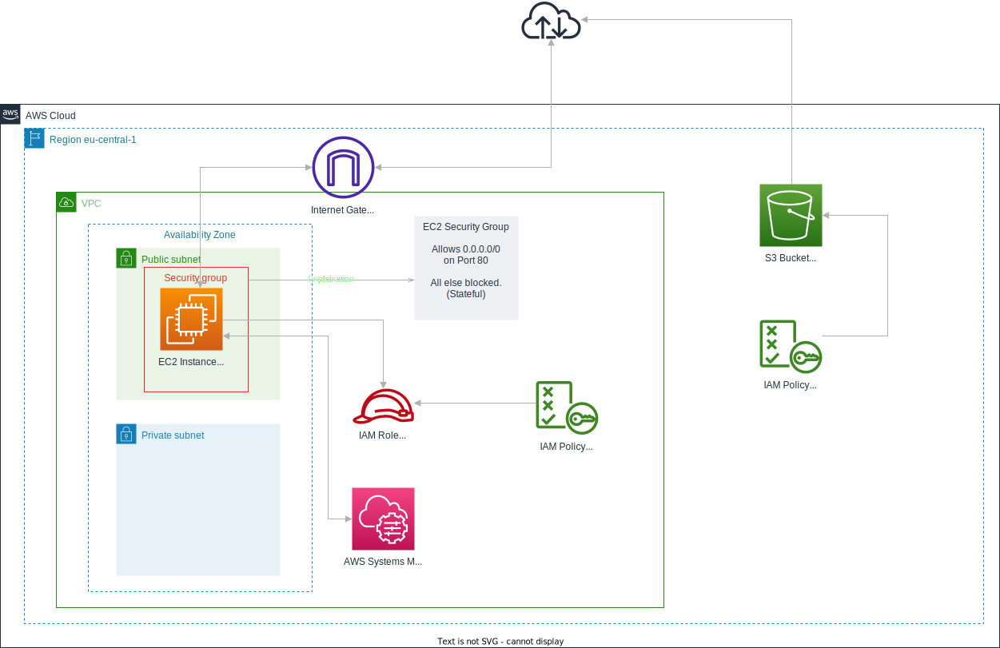

# Lab 4: Core AWS Services

## Deploy Core Services Using CDK

In this hands-on section, you will use AWS CDK to create an S3 bucket and an EC2 instance. You will also perform tasks in the AWS Management Console such as checking CloudWatch, adding a bucket policy, and running a CLI command to retrieve the instance ID.

## Prerequisites

For this and Lab 5, we will be continuing with the same stack and adding services to it. If you don't still have that stack, you can copy the code from here: FUTURE_LINK

## Use CDK to Create an S3 Bucket and an EC2 Instance

1. **Open Your CDK Project**

   Navigate to your existing CDK project directory.

2. **Extend the Stack File**

   Open the stack file located in the `lib` directory (e.g., `lib/aws-fundamentals-workshop-labs-stack.ts` for a TypeScript project). Add the following code to create an S3 bucket and an EC2 instance:

```typescript
import { CfnOutput, RemovalPolicy, Stack, StackProps } from 'aws-cdk-lib'
import {
  SubnetType,
  Vpc,
  SecurityGroup,
  Peer,
  Port,
  Instance,
  InstanceType,
  InstanceClass,
  InstanceSize,
  MachineImage,
  UserData,
} from 'aws-cdk-lib/aws-ec2'
import {
  ArnPrincipal,
  ManagedPolicy,
  PolicyStatement,
  Role,
  ServicePrincipal,
} from 'aws-cdk-lib/aws-iam'
import { BlockPublicAccess, Bucket } from 'aws-cdk-lib/aws-s3'
import { Construct } from 'constructs'

export class AwsFundamentalsWorkshopLabsStack extends Stack {
  constructor(scope: Construct, id: string, props?: StackProps) {
    super(scope, id, props)

    // Create a VPC
    const vpc = new Vpc(this, 'MyVpc', {
      natGateways: 1, // Default is one in each AZ, this creates only one instead of two.
      subnetConfiguration: [
        {
          cidrMask: 24,
          name: 'public',
          subnetType: SubnetType.PUBLIC,
        },
        {
          cidrMask: 24,
          name: 'private',
          subnetType: SubnetType.PRIVATE_WITH_EGRESS, // This creates a private subnet with egress access to the internet.
        },
      ],
    })

    // Security Group for EC2 instance
    const ec2SecurityGroup = new SecurityGroup(this, 'EC2SecurityGroup', {
      vpc,
      allowAllOutbound: true,
      description: 'Allow HTTP access to EC2 instance',
    })

    // Allow HTTP access to the EC2 instance
    ec2SecurityGroup.addIngressRule(
      Peer.anyIpv4(),
      Port.tcp(80),
      'Allow HTTP access'
    )

    // Security Group for RDS instance
    const rdsSecurityGroup = new SecurityGroup(this, 'RDSSecurityGroup', {
      vpc,
      allowAllOutbound: true,
      description: 'Allow MySQL access to RDS instance',
    })
    rdsSecurityGroup.addIngressRule(
      ec2SecurityGroup,
      Port.tcp(3306),
      'Allow MySQL access from EC2 instance'
    )

    // IAM role for EC2 instance to use SSM
    const role = new Role(this, 'SSMRole', {
      assumedBy: new ServicePrincipal('ec2.amazonaws.com'),
    })

    // Attach the AmazonSSMManagedInstanceCore managed policy to the role
    role.addManagedPolicy(
      ManagedPolicy.fromAwsManagedPolicyName('AmazonSSMManagedInstanceCore')
    )

    // Add S3 read permissions to the EC2 instance role
    role.addManagedPolicy(
      ManagedPolicy.fromAwsManagedPolicyName('AmazonS3ReadOnlyAccess')
    )

    // Create an EC2 instance
    const ec2Instance = new Instance(this, 'MyEC2Instance', {
      vpc,
      instanceType: InstanceType.of(InstanceClass.T2, InstanceSize.MICRO),
      machineImage: MachineImage.latestAmazonLinux2(),
      securityGroup: ec2SecurityGroup,
      vpcSubnets: { subnetType: SubnetType.PUBLIC },
      role: role,
      userData: UserData.forLinux(),
    })

    // Install AWS CLI on the EC2 instance
    ec2Instance.addUserData(
      'yum update -y',
      'yum install -y aws-cli',
      'echo "AWS CLI installed. You can now use AWS S3 commands to test bucket access."'
    )

    // Create an S3 bucket
    const bucket = new Bucket(this, 'MyBucket', {
      removalPolicy: RemovalPolicy.DESTROY,
      autoDeleteObjects: true,
      publicReadAccess: false, // Ensure the bucket is not publicly accessible
      blockPublicAccess: BlockPublicAccess.BLOCK_ALL, // Block all public access
    })

    // Add a bucket policy that allows access from the EC2 instance
    bucket.addToResourcePolicy(
      new PolicyStatement({
        actions: [
          's3:GetObject',
          's3:ListBucket',
          's3:PutObject',
          's3:DeleteObject',
          's3:DeleteBucket',
        ],
        resources: [bucket.bucketArn, bucket.arnForObjects('*')],
        principals: [new ArnPrincipal(ec2Instance.role.roleArn)],
      })
    )

    // Output the bucket name for easy reference
    new CfnOutput(this, 'BucketName', {
      value: bucket.bucketName,
      description: 'Name of the S3 bucket',
    })

    // Output the EC2 instance ID
    new CfnOutput(this, 'EC2InstanceId', {
      value: ec2Instance.instanceId,
    })

    // Output the Security Group IDs
    new CfnOutput(this, 'EC2SecurityGroupId', {
      value: ec2SecurityGroup.securityGroupId,
    })
    new CfnOutput(this, 'RDSSecurityGroupId', {
      value: rdsSecurityGroup.securityGroupId,
    })

    // Output the VPC ID
    new CfnOutput(this, 'VpcId', {
      value: vpc.vpcId,
    })
  }
}
```

## Explanation of the Code

- **VPC**: Sets up a VPC with public and private subnets and a NAT Gateway.
- **EC2 Security Group**: Allows HTTP (port 80) access to the EC2 instance.
- **EC2 Instance**: Creates an EC2 instance in the public subnet with the specified security group and IAM role for SSM access.
- **S3 Bucket**: Creates an S3 bucket with a destroy policy.
- **Bucket Policy**: Adds a policy to the S3 bucket allowing public read access.
- **Outputs**: Outputs the S3 bucket name and EC2 instance ID for verification.

3. **Deploy the Stack**

   To deploy the stack to your AWS account, run the following command from the root directory of your CDK project:

   ```bash
   cdk deploy --profile PROFILE_NAME
   ```

   This command updates the existing stack, adding the EC2 instance, updating IAM roles to allow access from EC2 to S3, and creating the S3 bucket with its associated bucket policy. The key changes in this update include:

   1. Creation of an EC2 instance in the public subnet
   2. Updating IAM roles to grant the EC2 instance access to S3
   3. Creation of an S3 bucket
   4. Addition of a bucket policy allowing access from the EC2 instance

   Review the changes carefully before confirming the deployment. This update will create new resources and modify existing ones to enable the interaction between EC2 and S3.

## Lab Architecture

Before we proceed with verifying the deployment, let's take a moment to review the architecture we've built in this lab:



This diagram illustrates the key components of our lab:

1. A Virtual Private Cloud (VPC) with public and private subnets spread across multiple Availability Zones, which we set up in the previous lab.
2. An EC2 instance launched in the public subnet, which we can connect to using Systems Manager Session Manager.
3. Security groups controlling inbound and outbound traffic for our EC2 instance.
4. An S3 bucket for storing objects, with a bucket policy controlling access.
5. IAM roles and policies managing permissions for the EC2 instance and S3 bucket access.

This architecture demonstrates a secure and scalable setup for core AWS services, allowing us to manage compute resources and object storage while maintaining proper security controls and monitoring capabilities.

Now, let's proceed with verifying the deployment of these resources:

1. **Verify the Deployment**

   - **AWS Management Console**:

     - Navigate to the S3 service and find the bucket created by the stack.
     - Navigate to the EC2 service and find the instance created by the stack.

   - **Connect to EC2 instance and interact with S3 bucket**:

     1. In the EC2 console, select your instance and click "Connect".
     2. In the "Connect to instance" dialog, select the "Session Manager" tab and click "Connect".
     3. Once connected, create a simple HTML file:
        ```bash
        cd /tmp
        echo "<html><body><h1>Hello from EC2</h1></body></html>" > test.html
        ```
     4. Upload the file to the S3 bucket:
        ```bash
        aws s3 cp test.html s3://BUCKET_NAME/test.html
        ```
     5. Verify the object was uploaded:
        ```bash
        aws s3 ls s3://BUCKET_NAME
        ```

   - **Web Browser Access Test**:
     1. In the AWS Management Console, navigate to the S3 service and select your bucket.
     2. Find the `test.html` file you just uploaded.
     3. Copy the Object URL of the `test.html` file.
     4. Open a new tab in your web browser and paste the Object URL.
     5. You should receive an "Access Denied" error, indicating that the file is not publicly accessible.

   This verification process demonstrates that while the EC2 instance can upload files to the S3 bucket, these files are not publicly accessible through a web browser. This showcases the effective use of S3 bucket policies in controlling access to your resources.

2. **Verify a Bucket Policy**

   - **AWS Management Console**:
     - Navigate to the S3 service, select the created bucket.
     - Go to the "Permissions" tab and verify the bucket policy is in place.

   Example of verifying bucket policy:

   ```json
   {
     "Version": "2012-10-17",
     "Statement": [
       {
         "Effect": "Allow",
         "Principal": {
           "AWS": "AUTOGENERATED_BY_CDK"
         },
         "Action": [
           "s3:DeleteObject*",
           "s3:GetBucket*",
           "s3:List*",
           "s3:PutBucketPolicy"
         ],
         "Resource": ["arn:aws:s3:::BUCKET_NAME", "arn:aws:s3:::BUCKET_NAME/*"]
       },
       {
         "Effect": "Allow",
         "Principal": {
           "AWS": "AUTOGENERATED_BY_CDK"
         },
         "Action": [
           "s3:DeleteBucket",
           "s3:DeleteObject",
           "s3:GetObject",
           "s3:ListBucket",
           "s3:PutObject"
         ],
         "Resource": ["arn:aws:s3:::BUCKET_NAME", "arn:aws:s3:::BUCKET_NAME/*"]
       }
     ]
   }
   ```

## Checkpoint

At this point, you should have:

- Created an S3 bucket using CDK
- Launched an EC2 instance in the public subnet
- Configured the EC2 instance to use Systems Manager Session Manager
- Successfully connected to the EC2 instance using Session Manager
- Successfully uploaded a file to the S3 bucket
- Successfully verified the bucket policy

If you're encountering issues, check the following:

- Verify that the S3 bucket was created successfully
- Ensure the EC2 instance has the correct IAM role for Systems Manager access
- Check that the VPC endpoints for Systems Manager are correctly configured

## Best Practices and Security Considerations

### EC2 Instance Management

1. Use IAM roles instead of storing AWS credentials on EC2 instances.
2. Regularly patch and update your EC2 instances to maintain security.
3. Use Amazon CloudWatch for monitoring and set up alarms for critical metrics.
4. Implement proper security group rules to control inbound and outbound traffic.
5. Use Amazon EC2 Auto Scaling to automatically adjust capacity based on demand.
6. Use EC2 Instance Metadata Service Version 2 (IMDSv2) for improved security.

### S3 Security

1. Implement S3 bucket policies to control access to your data.
2. Enable versioning on buckets to protect against accidental deletions or overwrites.
3. Use S3 server-side encryption for data at rest.
4. Implement lifecycle policies to manage object retention and reduce costs.

### General Security

1. Follow the principle of least privilege when assigning permissions.
2. Enable AWS CloudTrail to log API calls for your account.
3. Regularly review and audit your security configurations.
4. Use AWS Config to assess, audit, and evaluate the configurations of your AWS resources.

### Performance and Cost Optimization

1. Choose the right instance types based on your workload requirements.
2. Use Amazon EC2 Spot Instances for flexible, fault-tolerant applications to reduce costs.
3. Implement caching strategies using services like Amazon ElastiCache to improve performance.
4. Use AWS Trusted Advisor to get real-time guidance on best practices for cost optimization, security, fault tolerance, and performance improvement.

## S3 Bucket Policies and Versioning

When creating an S3 bucket, consider implementing these security features:

1. Bucket Policy: Restrict access to your S3 bucket using a bucket policy. Here's an example that allows read access only from a specific IAM role:

```typescript
const myBucketPolicy = new s3.BucketPolicy(this, 'MyBucketPolicy', {
  bucket: myBucket,
})

myBucketPolicy.document.addStatements(
  new iam.PolicyStatement({
    actions: ['s3:GetObject'],
    resources: [myBucket.arnForObjects('*')],
    principals: [new iam.ArnPrincipal('arn:aws:iam::123456789012:role/MyRole')],
  })
)
```

2. Versioning: Enable versioning to keep multiple variants of objects in the bucket:

```typescript
const myBucket = new s3.Bucket(this, 'MyBucket', {
  versioned: true,
  removalPolicy: cdk.RemovalPolicy.DESTROY,
  autoDeleteObjects: true,
})
```

Excellent! You have now successfully created and deployed an S3 bucket and an EC2 instance using AWS CDK. You've also verified their configurations and interacted with them through the AWS Management Console and Session Manager. This lab has expanded your understanding of managing basic AWS services both programmatically and through the AWS console.
