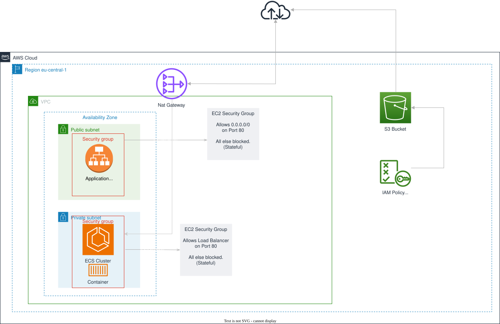

# Lab 4: Core AWS Services

## Deploy Core Services Using CDK

In this hands-on section, you will use AWS CDK to create an S3 bucket and an ECS Service. You will also perform tasks in the AWS Management Console such as checking CloudWatch, and adding a bucket policy.

## Prerequisites

For this and Lab 5, we will be continuing with the same stack and adding services to it. If you don't still have that stack, you can copy the code from here: [Lab 3 Stack](https://github.com/superluminar-io/aws_fundamentals_workshop_labs/blob/main/lab_3/lib/aws-fundamentals-workshop-labs-stack.ts)

## Use CDK to Create an S3 Bucket and an ECS Service

1. **Open Your CDK Project**

   Navigate to your existing CDK project directory.

2. **Extend the Stack File**

   Open the stack file located in the `lib` directory (e.g., `lib/aws-fundamentals-workshop-labs-stack.ts` for a TypeScript project). Add the following code to create an S3 bucket and an ECS Service:

```typescript
import {CfnOutput, RemovalPolicy, Stack, StackProps} from 'aws-cdk-lib'
import {
  SubnetType,
  Vpc,
  SecurityGroup,
  Port,
} from 'aws-cdk-lib/aws-ec2'
import {
  ArnPrincipal,
  PolicyStatement,
} from 'aws-cdk-lib/aws-iam'
import {BlockPublicAccess, Bucket} from 'aws-cdk-lib/aws-s3'
import {Construct} from 'constructs'
import {
  Cluster,
  ContainerImage,
  FargateService,
  FargateTaskDefinition,
  ListenerConfig,
  LogDrivers
} from "aws-cdk-lib/aws-ecs";
import {ApplicationLoadBalancer, ApplicationProtocol} from "aws-cdk-lib/aws-elasticloadbalancingv2";

export class AwsFundamentalsWorkshopLabsStack extends Stack {
  constructor(scope: Construct, id: string, props?: StackProps) {
    super(scope, id, props)

    // Create a VPC
    const vpc = new Vpc(this, 'MyVpc', {
      natGateways: 1, // Default is one in each AZ, this creates only one instead of two.
      subnetConfiguration: [
        {
          cidrMask: 24,
          name: 'public',
          subnetType: SubnetType.PUBLIC,
        },
        {
          cidrMask: 24,
          name: 'private',
          subnetType: SubnetType.PRIVATE_WITH_EGRESS, // This creates a private subnet with egress access to the internet.
        },
      ],
    })

    // Create the ECS Cluster
    const cluster = new Cluster(this, 'FargateCluster', {
      vpc,
    });
    // Create a Fargate Task Definition with a Container
    const fargateTaskDefinition = new FargateTaskDefinition(this, 'TaskDef');
    fargateTaskDefinition.addContainer('AppContainer', {
      containerName: 'web',
      image: ContainerImage.fromRegistry('ghcr.io/superluminar-io/dct:latest'),
      memoryLimitMiB: 512,
      cpu: 256,
      logging: LogDrivers.awsLogs({streamPrefix: 'myApp/webapp'}),
      portMappings: [{containerPort: 8081}],
      environment: {
        DB_HOST: 'some-host',
        DB_USERNAME: 'some-user',
        DB_PASSWORD: 'some-password',
      }
    });

    // Create a Fargate Service
    const service = new FargateService(this, 'FargateService', {
      cluster,
      taskDefinition: fargateTaskDefinition,
      minHealthyPercent: 100,
      vpcSubnets: {subnetType: SubnetType.PRIVATE_WITH_EGRESS},
    });

    // Create an Application Load Balancer that listens on port 80
    const lb = new ApplicationLoadBalancer(this, 'LoadBalancer', {vpc, internetFacing: true});
    const listener = lb.addListener('LBListener', {port: 80});

    // Register the ECS Service as a target of the Application Load Balancer
    service.registerLoadBalancerTargets(
      {
        containerName: 'web',
        containerPort: 8081,
        newTargetGroupId: 'ecs_webapp',
        listener: ListenerConfig.applicationListener(listener, {
          protocol: ApplicationProtocol.HTTP,
        }),
      },
    );

    // Security Group for RDS instance that allows ingress from the ECS service
    const rdsSecurityGroup = new SecurityGroup(this, 'RDSSecurityGroup', {
      vpc,
      allowAllOutbound: true,
      description: 'Allow MySQL access to RDS instance',
    })
    rdsSecurityGroup.addIngressRule(
      service.connections.securityGroups[0],
      Port.tcp(3306),
      'Allow MySQL access from ECS service'
    )

    // Create an S3 bucket
    const bucket = new Bucket(this, 'MyBucket', {
      removalPolicy: RemovalPolicy.DESTROY,
      autoDeleteObjects: true,
      publicReadAccess: false, // Ensure the bucket is not publicly accessible
      blockPublicAccess: BlockPublicAccess.BLOCK_ALL, // Block all public access
    })

    // Add a bucket policy that allows access from the ECS service
    bucket.addToResourcePolicy(
      new PolicyStatement({
        actions: [
          's3:GetObject',
          's3:ListBucket',
          's3:PutObject',
          's3:DeleteObject',
          's3:DeleteBucket',
        ],
        resources: [bucket.bucketArn, bucket.arnForObjects('*')],
        principals: [new ArnPrincipal(service.taskDefinition.taskRole.roleArn)],
      })
    )

    //Output the Load Balancer DNS Name for easy reference
    new CfnOutput(this, 'LoadBalancerDNS', {
      value: lb.loadBalancerDnsName,
      description: 'DNS Name of the Application Load Balancer',
    })

    // Output the bucket name for easy reference
    new CfnOutput(this, 'BucketName', {
      value: bucket.bucketName,
      description: 'Name of the S3 bucket',
    })

    // Output the RDS Security Group ID for easy reference
    new CfnOutput(this, 'RDSSecurityGroupId', {
      value: rdsSecurityGroup.securityGroupId,
    })

    // Output the VPC ID
    new CfnOutput(this, 'VpcId', {
      value: vpc.vpcId,
    })
  }
}
```

## Explanation of the Code

- **VPC**: Sets up a VPC with public and private subnets and a NAT Gateway.
- **ECS Cluster**: Creates an ECS cluster to run the Fargate service.
- **Fargate Task Definition**: Defines a task definition for the Fargate service with an Nginx container.
- **Fargate Service**: Creates a Fargate service that runs the Nginx container.
- **Application Load Balancer**: Creates an Application Load Balancer to route traffic to the ECS service.
- **Security Group**: Creates a security group for the RDS instance that allows ingress from the ECS service.
- **S3 Bucket**: Creates an S3 bucket with a bucket policy that allows access from the ECS service.
- **Bucket Policy**: Adds a policy to the S3 bucket allowing public read access.
- **Outputs**: Outputs the S3 bucket name for verification.

3. **Deploy the Stack**

   To deploy the stack to your AWS account, run the following command from the root directory of your CDK project:

   ```bash
   cdk deploy --profile PROFILE_NAME
   ```

   This command updates the existing stack, adding the ECS Service, updating IAM roles to allow access from ECS to S3, and creating the S3 bucket with its associated bucket policy. The key changes in this update include:

   1. Creation of an ECS cluster and service in the private subnet
   2. Creation of an Application Load Balancer to route traffic to the ECS service in the public subnet
   2. Updating IAM roles to grant the ECS service access to S3
   3. Creation of an S3 bucket
   4. Addition of a bucket policy allowing access from the ECS service

   Review the changes carefully before confirming the deployment. This update will create new resources and modify existing ones to enable the interaction between ECS and S3.

## Lab Architecture

Before we proceed with verifying the deployment, let's take a moment to review the architecture we've built in this lab:



This diagram illustrates the key components of our lab:

1. A Virtual Private Cloud (VPC) with public and private subnets spread across multiple Availability Zones, which we set up in the previous lab.
2. An ECS service launched in the private subnet.
3. An Application Load Balancer (ALB) in the public subnet routing traffic to the ECS service.
4. Security groups controlling inbound and outbound traffic for our ECS service.
5. An S3 bucket for storing objects, with a bucket policy controlling access.
6. IAM roles and policies managing permissions for the ECS service and S3 bucket access.

This architecture demonstrates a secure and scalable setup for core AWS services, allowing us to manage compute resources and object storage while maintaining proper security controls and monitoring capabilities.

Now, let's proceed with verifying the deployment of these resources:

1. **Verify the Deployment**

   - **AWS Management Console**:

     - Navigate to the S3 service and find the bucket created by the stack.
     - Navigate to the ECS service and find the instance created by the stack.

[//]: # (TODO: Add verification steps for S3 and ECS (connecting to container?))
   - **Connect to ECS container and interact with S3 bucket**:

     1. In the EC2 console, select your instance and click "Connect".
     2. In the "Connect to instance" dialog, select the "Session Manager" tab and click "Connect".
     3. Once connected, create a simple HTML file:
        ```bash
        cd /tmp
        echo "<html><body><h1>Hello from EC2</h1></body></html>" > test.html
        ```
     4. Upload the file to the S3 bucket:
        ```bash
        aws s3 cp test.html s3://BUCKET_NAME/test.html
        ```
     5. Verify the object was uploaded:
        ```bash
        aws s3 ls s3://BUCKET_NAME
        ```

   - **Web Browser Access Test**:
     1. In the AWS Management Console, navigate to the EC2 service and select load balancer.
     2. Find the DNS name of the Application Load Balancer.
     3. Open a new tab in your web browser and paste the URL.
     4. You should see a message indicating the web app is running.

2. **Verify a Bucket Policy**

   - **AWS Management Console**:
     - Navigate to the S3 service, select the created bucket.
     - Go to the "Permissions" tab and verify the bucket policy is in place.

   Example of verifying bucket policy:

   ```json
   {
     "Version": "2012-10-17",
     "Statement": [
       {
         "Effect": "Allow",
         "Principal": {
           "AWS": "AUTOGENERATED_BY_CDK"
         },
         "Action": [
           "s3:DeleteObject*",
           "s3:GetBucket*",
           "s3:List*",
           "s3:PutBucketPolicy"
         ],
         "Resource": ["arn:aws:s3:::BUCKET_NAME", "arn:aws:s3:::BUCKET_NAME/*"]
       },
       {
         "Effect": "Allow",
         "Principal": {
           "AWS": "AUTOGENERATED_BY_CDK"
         },
         "Action": [
           "s3:DeleteBucket",
           "s3:DeleteObject",
           "s3:GetObject",
           "s3:ListBucket",
           "s3:PutObject"
         ],
         "Resource": ["arn:aws:s3:::BUCKET_NAME", "arn:aws:s3:::BUCKET_NAME/*"]
       }
     ]
   }
   ```

## Checkpoint

At this point, you should have:

- Created an S3 bucket using CDK
- Launched an ECS service in the private subnet
- Successfully connected to the ECS service via HTTP and interacted with the S3 bucket

## Best Practices and Security Considerations

### ECS with Fargate Management

1. Use IAM roles for tasks instead of storing AWS credentials within containers.
2. Ensure your container images are regularly updated and patched for security.
3. Use Amazon CloudWatch for monitoring ECS services and set up alarms for critical metrics.
4. Implement proper security group rules to control inbound and outbound traffic for tasks.
5. Use ECS Service Auto Scaling to automatically adjust task count based on demand.
6. Use AWS Secrets Manager or AWS Systems Manager Parameter Store to securely manage sensitive data.

### S3 Security

1. Implement S3 bucket policies to control access to your data.
2. Enable versioning on buckets to protect against accidental deletions or overwrites.
3. Use S3 server-side encryption for data at rest.
4. Implement lifecycle policies to manage object retention and reduce costs.

### General Security

1. Follow the principle of least privilege when assigning permissions.
2. Enable AWS CloudTrail to log API calls for your account.
3. Regularly review and audit your security configurations.
4. Use AWS Config to assess, audit, and evaluate the configurations of your AWS resources.

### Performance and Cost Optimization

1. Choose the right ECS task size based on your workload requirements.
2. Use Amazon Fargate Spot Instances for flexible, fault-tolerant applications to reduce costs.
3. Implement caching strategies using services like Amazon ElastiCache to improve performance.
4. Use AWS Trusted Advisor to get real-time guidance on best practices for cost optimization, security, fault tolerance, and performance improvement.

## S3 Bucket Policies and Versioning

When creating an S3 bucket, consider implementing these security features:

1. Bucket Policy: Restrict access to your S3 bucket using a bucket policy. Here's an example that allows read access only from a specific IAM role:

```typescript
const myBucketPolicy = new s3.BucketPolicy(this, 'MyBucketPolicy', {
  bucket: myBucket,
})

myBucketPolicy.document.addStatements(
  new iam.PolicyStatement({
    actions: ['s3:GetObject'],
    resources: [myBucket.arnForObjects('*')],
    principals: [new iam.ArnPrincipal('arn:aws:iam::123456789012:role/MyRole')],
  })
)
```

2. Versioning: Enable versioning to keep multiple variants of objects in the bucket:

```typescript
const myBucket = new s3.Bucket(this, 'MyBucket', {
  versioned: true,
  removalPolicy: cdk.RemovalPolicy.DESTROY,
  autoDeleteObjects: true,
})
```

Excellent! You have now successfully created and deployed an S3 bucket and an ECS service using AWS CDK. You've also verified their configurations and interacted with them through the AWS Management Console. This lab has expanded your understanding of managing basic AWS services both programmatically and through the AWS console.
