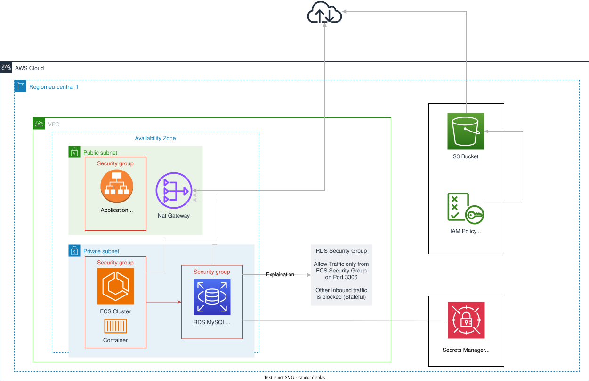

# Lab 5: Amazon RDS

## Set up RDS for Relational Data Storage Using Pulumi

In this hands-on section, you will extend the existing Pulumi project from the previous labs to create an RDS instance. You will configure security groups and database parameters to set up a secure and optimized relational database.

## Prerequisites

For this lab, continue with the code you created in Labs 3 and 4. If you need to start fresh or restore the previous setup, use the following link to get the starting code: [Lab 4 Stack](https://github.com/superluminar-io/aws_fundamentals_workshop_labs/blob/main/lab_4/lib/aws-fundamentals-workshop-labs-stack.ts)

## Create an RDS Instance with Pulumi

1. **Open Your Pulumi Project**

   Navigate to your existing Pulumi project directory.

2. **Extend the index.ts File**

   Open the `index.ts` file. Add the following code to create an RDS instance:

```typescript
import * as pulumi from "@pulumi/pulumi";
import * as aws from "@pulumi/aws";

// Create a VPC
const vpc = new aws.ec2.Vpc("MyVpc", {
    cidrBlock: "10.0.0.0/16",
    enableDnsHostnames: true,
    enableDnsSupport: true,
});
// Create an Internet Gateway
const internetGateway = new aws.ec2.InternetGateway("MyInternetGateway", {
    vpcId: vpc.id,
});

// Create public subnet
const publicSubnet = new aws.ec2.Subnet("PublicSubnet", {
    vpcId: vpc.id,
    cidrBlock: "10.0.1.0/24",
});

// Create private subnet
const privateSubnet = new aws.ec2.Subnet("PrivateSubnet", {
    vpcId: vpc.id,
    cidrBlock: "10.0.2.0/24",
});

// Create public route table
const publicRouteTable = new aws.ec2.RouteTable("PublicRouteTable", {
    vpcId: vpc.id,
    routes: [{
        cidrBlock: "0.0.0.0/0",
        gatewayId: internetGateway.id,
    }],
});

// Associate public subnet with public route table
new aws.ec2.RouteTableAssociation("PublicSubnetRouteTableAssociation", {
    subnetId: publicSubnet.id,
    routeTableId: publicRouteTable.id,
});

// Create NAT Gateway (in public subnet)
const eip = new aws.ec2.Eip("NatEip", {});
const natGateway = new aws.ec2.NatGateway("MyNatGateway", {
    allocationId: eip.id,
    subnetId: publicSubnet.id,
});

// Create private route table
const privateRouteTable = new aws.ec2.RouteTable("PrivateRouteTable", {
    vpcId: vpc.id,
    routes: [{
        cidrBlock: "0.0.0.0/0",
        natGatewayId: natGateway.id,
    }],
});

// Associate private subnet with private route table
new aws.ec2.RouteTableAssociation("PrivateSubnetRouteTableAssociation", {
    subnetId: privateSubnet.id,
    routeTableId: privateRouteTable.id,
});

// Create security groups
const ec2SecurityGroup = new aws.ec2.SecurityGroup("EC2SecurityGroup", {
    vpcId: vpc.id,
    description: "Allow HTTP access to EC2 instance",
    ingress: [{
        protocol: "tcp",
        fromPort: 80,
        toPort: 80,
        cidrBlocks: ["0.0.0.0/0"],
        description: "Allow HTTP access"
    }],
    egress: [{
        protocol: "-1",
        fromPort: 0,
        toPort: 0,
        cidrBlocks: ["0.0.0.0/0"],
    }],
    tags: {
        Name: "EC2SecurityGroup"
    }
});

const rdsSecurityGroup = new aws.ec2.SecurityGroup("RDSSecurityGroup", {
    vpcId: vpc.id,
    description: "Allow MySQL access to RDS instance",
    ingress: [{
        protocol: "tcp",
        fromPort: 3306,
        toPort: 3306,
        securityGroups: [ec2SecurityGroup.id],
        description: "Allow MySQL access from EC2 instance"
    }],
    egress: [{
        protocol: "-1",
        fromPort: 0,
        toPort: 0,
        cidrBlocks: ["0.0.0.0/0"],
    }],
    tags: {
        Name: "RDSSecurityGroup"
    }
});

// Create IAM role for EC2 instance to use SSM
const ssmRole = new aws.iam.Role("SSMRole", {
    assumeRolePolicy: JSON.stringify({
        Version: "2012-10-17",
        Statement: [{
            Action: "sts:AssumeRole",
            Effect: "Allow",
            Principal: {
                Service: "ec2.amazonaws.com"
            }
        }]
    }),
    managedPolicyArns: [
      "arn:aws:iam::aws:policy/AmazonSSMManagedInstanceCore",
      "AmazonS3ReadOnlyAccess"
    ]
});

// Create an EC2 instance
const ec2Instance = new aws.ec2.Instance("MyEC2Instance", {
    ami: aws.ec2.getAmiOutput({
        mostRecent: true,
        owners: ["amazon"],
        filters: [{
            name: "name",
            values: ["amzn2-ami-hvm-*-x86_64-gp2"],
        }],
    }).id,
    instanceType: "t2.micro",
    subnetId: publicSubnet.id,
    vpcSecurityGroupIds: [ec2SecurityGroup.id],
    iamInstanceProfile: new aws.iam.InstanceProfile("ec2InstanceProfile", {
        role: ssmRole.name,
    }).name,
    userData: `#!/bin/bash
      yum update -y
      yum install -y aws-cli
      echo "AWS CLI installed. You can now use AWS S3 commands to test bucket access."`,
    });

// Create an S3 bucket
const bucket = new aws.s3.BucketV2("MyBucket", {
    forceDestroy: true,
});

// Block all public access
new aws.s3.BucketPublicAccessBlock("MyBucketPublicAccessBlock", {
    bucket: bucket.id,
    blockPublicAcls: true,
    blockPublicPolicy: true,
    ignorePublicAcls: true,
    restrictPublicBuckets: true,
});

// Add bucket policy for EC2 instance access
new aws.s3.BucketPolicy("MyBucketPolicy", {
    bucket: bucket.id,
    policy: pulumi.all([bucket.arn, ssmRole.arn]).apply(([bucketArn, roleArn]) => JSON.stringify({
        Version: "2012-10-17",
        Statement: [{
            Effect: "Allow",
            Principal: {
                AWS: roleArn,
            },
            Action: [
                "s3:GetObject",
                "s3:ListBucket",
                "s3:PutObject",
                "s3:DeleteObject",
                "s3:DeleteBucket",
            ],
            Resource: [
                bucketArn,
                `${bucketArn}/*`,
            ],
        }],
    })),
});
// Create an RDS instance
const rdsInstance = new aws.rds.Instance("MyRDSInstance", {
    // MySQL engine and version
    engine: "mysql",
    engineVersion: "8.0.37",
    
    // Instance configuration
    instanceClass: "db.t3.micro",
    
    // Network configuration
    vpcSecurityGroupIds: [rdsSecurityGroup.id],
    dbSubnetGroupName: new aws.rds.SubnetGroup("rds-subnet-group", {
        subnetIds: [privateSubnet.id],
    }).id,
    
    // Storage configuration
    allocatedStorage: 20,
    maxAllocatedStorage: 100,
    
    // Database configuration
    dbName: "MyDatabase",
    username: "admin",
    
    // Generate random password and store in Secrets Manager
    manageMainUserPassword: true,
    
    // Backup configuration
    backupRetentionPeriod: 7,
    
    // Upgrade settings
    allowMajorVersionUpgrade: false,
    autoMinorVersionUpgrade: true,
    
    // Protection settings
    deletionProtection: false,
    
    // Availability
    multiAz: false,
});

// Export the resource IDs
export const vpcId = vpc.id;
export const ec2SecurityGroupId = ec2SecurityGroup.id;
export const rdsSecurityGroupId = rdsSecurityGroup.id;
export const ssmRoleArn = ssmRole.arn;
export const bucketName = bucket.id;
export const ec2InstanceId = ec2Instance.id;
export const rdsInstanceId = rdsInstance.endpoint;
```

## Lab Architecture

Before we proceed with verifying the deployment, let's take a moment to review the architecture we've built in this lab:



This diagram illustrates the key components of our lab:

1. A Virtual Private Cloud (VPC) with public and private subnets spread across multiple Availability Zones, which we set up in previous labs.
2. An EC2 instance launched in the public subnet, which we can connect to using Systems Manager Session Manager.
3. An RDS MySQL instance deployed in a private subnet, providing a managed relational database service.
4. Security groups controlling inbound and outbound traffic for both our EC2 instance and RDS instance.
5. A NAT Gateway allowing the RDS instance in the private subnet to access the internet for updates and patches.
6. AWS Secrets Manager storing the credentials for the RDS instance, enhancing security.

This architecture demonstrates a secure and scalable setup for integrating compute and database resources:

- The EC2 instance in the public subnet can be accessed for management purposes and could host an application.
- The RDS instance is protected in a private subnet, not directly accessible from the internet.
- The security group rules allow the EC2 instance to communicate with the RDS instance on the MySQL port (3306).
- By using Secrets Manager, we avoid hardcoding database credentials and can rotate them easily.

This setup provides a solid foundation for building applications that require both compute power and a relational database, while maintaining proper security controls and following AWS best practices.

## Explanation of the Code

- **VPC**: Sets up a VPC with public and private subnets and a NAT Gateway.
- **EC2 Security Group**: Allows HTTP (port 80) access to the EC2 instance.
- **IAM Role**: Creates an IAM role for the EC2 instance to use Systems Manager (SSM).
- **EC2 Instance**: Launches an EC2 instance in the public subnet with the SSM role attached.
- **RDS Security Group**: Allows MySQL (port 3306) access from the EC2 security group.
- **RDS Instance**: Creates an RDS MySQL instance in the private subnet with generated credentials stored in AWS Secrets Manager.
  - Configures various parameters like instance type, storage, backups, and database name.
- **Outputs**: Outputs the RDS instance endpoint, secret ARN, and security group IDs for verification.

This setup creates a complete environment with both compute (EC2) and database (RDS) resources, properly secured within a VPC structure.

3. **Deploy the Code**

   To deploy the code to your AWS account, run the following command from the root directory of your Pulumi project:

   ```bash
   pulumi up
   ```

   This command deploys your Pulumi resources to your AWS account, creating the specified VPC, security groups, and RDS instance.

4. **Verify the Deployment**

   - **AWS Management Console**:

     - Navigate to the RDS service and find the instance created by the stack.
     - Check the security groups to ensure they are configured correctly.

   - **AWS CLI**:
     Run the following command to retrieve the RDS instance details:
     ```bash
     aws rds describe-db-instances \
     --db-instance-identifier INSTANCE_IDENTIFIER \
     --query "DBInstances[*].[DBInstanceIdentifier,DBInstanceStatus,Endpoint.Address]" \
     --output table \
     --profile PROFILE_NAME
     ```

5. **Connect to the RDS Instance from the EC2 Instance**

   To connect to your RDS instance from the EC2 instance, follow these steps:

   a. Connect to your EC2 instance using AWS Systems Manager Session Manager.

   b. Install the MySQL client on the EC2 instance:

   ```bash
   sudo yum install mysql -y
   ```

   c. Retrieve the RDS endpoint and credentials:

   - Get the RDS endpoint from the Pulumi output or the RDS console.
   - Retrieve the database credentials from AWS Secrets Manager on your computer's terminal (don't use the Session Manager session for this step):
     ```bash
     aws secretsmanager get-secret-value --secret-id SECRET_ARN --query SecretString --output text --profile PROFILE_NAME
     ```
     Replace SECRET_ARN with the actual Secret ARN from the Pulumi output.

   d. Connect to the RDS instance using the MySQL client from the Session Manager session using the RDS endpoint from the Pulumi output:

   ```bash
   mysql -h RDS_ENDPOINT -u admin -p
   ```

   Enter the password when prompted.

   e. Once connected, you can verify the connection by running a simple SQL command:

   ```sql
   SHOW DATABASES;
   ```

   If you can successfully connect and run SQL commands, you've verified the connection between your EC2 instance and the RDS instance.

## Checkpoint

At this point, you should have:

- Created an RDS instance in the private subnet
- Configured the database security group
- Set up a secret in AWS Secrets Manager for database credentials
- Modified the EC2 instance to allow communication with the RDS instance
- Successfully connected to the RDS instance from the EC2 instance

If you're encountering issues, check the following:

- Ensure the RDS instance is in the correct subnet group
- Verify that the security group allows traffic from the EC2 instance to the RDS instance
- Check that the secret in Secrets Manager is correctly formatted
- Make sure the EC2 instance has the necessary permissions to access Secrets Manager
- Verify that you can resolve the RDS endpoint from the EC2 instance

## Best Practices and Security Considerations

1. Enable encryption at rest for your RDS instances.
2. Use SSL/TLS to encrypt connections to your RDS instance.
3. Regularly back up your databases and test the restore process.
4. Use Multi-AZ deployments for high availability and failover support.
5. Implement performance insights to monitor database performance.

## Additional Information: RDS Backup, Restore, and Encryption

The following sections provide informational content about RDS backup, restore procedures, and encryption options. These are not part of the hands-on exercise but are important concepts to understand when working with RDS in production environments.

### RDS Backup and Restore Procedures (Informational)

1. Automated Backups:

   In production environments, you would typically enable automated backups when creating your RDS instance:

   ```typescript
   const rdsInstance = new aws.rds.Instance("MyRDSInstance", {
     // ... other configuration ...
     backupRetentionPeriod: 7,
   })
   ```

2. Manual Snapshots:

   Before making major changes, you might create a manual snapshot:

   ```bash
   aws rds create-db-snapshot --db-instance-identifier my-database --db-snapshot-identifier my-snapshot --region <YOUR_REGION>
   ```

3. Restore from Snapshot:
   To restore from a snapshot, you would use the AWS Management Console or AWS CLI:
   ```bash
   aws rds restore-db-instance-from-db-snapshot --db-instance-identifier my-new-database --db-snapshot-identifier my-snapshot --region <YOUR_REGION>
   ```

### RDS Encryption Options (Informational)

1. Encryption at Rest:

   In a production environment, you would typically enable encryption at rest when creating your RDS instance:

   ```typescript
   const rdsInstance = new aws.rds.Instance("MyRDSInstance", {
     // ... other configuration ...
     storageEncrypted: true,
     kmsKeyId: "<KEY_ARN>"
   })
   ```

2. Encryption in Transit:
   For secure connections, you would use SSL/TLS for connections to your RDS instance. In your application, you would ensure you're using an SSL-enabled connection string.

Note: The above examples are for illustrative purposes and are not part of this lab's hands-on exercises. They represent best practices for production environments.

## Summary of Steps

- Set up the VPC and security groups using Pulumi.
- Create an RDS instance with the specified configurations.
- Deploy the stack and verify the RDS instance using the AWS Management Console and CLI.
- Configure database parameters and option groups to optimize the RDS instance.

You've successfully set up an RDS instance for relational data storage using Pulumi. This lab completes your journey through creating and managing various AWS services using Pulumi, equipping you with practical skills for building and managing cloud infrastructure.
