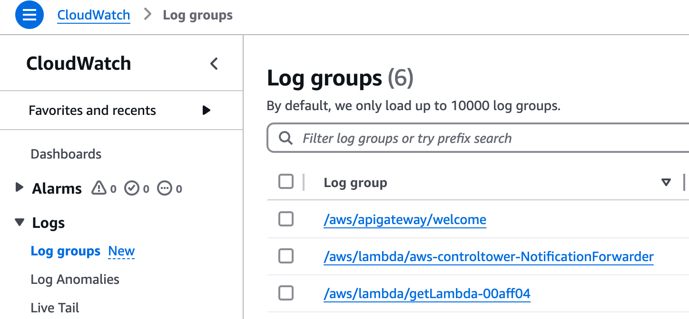
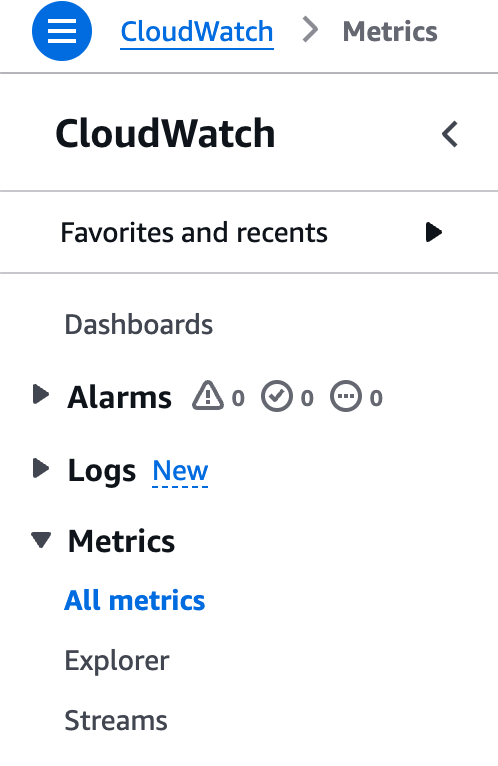

# Lab 6: Operations & Troubleshooting

## Introduction to Operations & Error Handling in AWS

In this lab, we'll cover the basics of troubleshooting ECS Fargate infrastructure and setting up automated deployments. This includes configuring CI/CD pipelines with GitHub Actions and identifying and resolving common issues in ECS Fargate.

## Automated Deployments for CDK and ECS Fargate
As we already noted through our other hands-on labs, ECS Fargate provides container deployment strategies out of the box, such as rolling updates and blue/green deployments.
However, we didn't take a closer look at automating the deployment of our infrastructure using the AWS Cloud Development Kit (CDK) and CI/CD pipelines.

### Best Practices for Automated Deployments
- **Environment Isolation**: Separate environments (e.g., dev, test, prod) to prevent changes from affecting production.
- **Immutable Infrastructure**: Treat your infrastructure as immutable to avoid configuration drift and ensure consistency.
- **Secrets Management**: Securely manage secrets and sensitive information using AWS Secrets Manager or Parameter Store or comparable services.
- **Rollback Strategies**: Implement rollback strategies to revert changes in case of deployment failures.
- **Disaster Recovery**: Implement disaster recovery plans to recover from failures and ensure business continuity.
- **Monitoring & Alerts**: Set up monitoring and alerts to detect issues and respond proactively.
- **Automated Testing**: Include automated tests in your CI/CD pipeline to validate your infrastructure changes.

We'll take a closer look at setting up CI/CD pipelines with GitHub Actions for deploying the CDK applications in the hands-on lab.

## Troubleshooting ECS Fargate
### Common Issues and Solutions
#### 1. Task Definition Issues:  
- **Problem:** Task fails to start.
- **Solution:**  Check the task definition for errors, such as incorrect container image URIs or missing environment variables. Check Amazon ECR permissions if using private images.

#### 2. Service Deployment Issues:  
- **Problem:**  Service fails to reach the desired number of tasks.
- **Solution:**  Review the service events in the ECS console for error messages. Common issues include insufficient CPU/memory resources or IAM role permissions.  

#### 3. Networking and Access Issues:  
- **Problem:**  Tasks cannot communicate with each other or external services.
- **Solution:**  Verify the VPC, subnets, and security group configurations. Ensure that the tasks have the necessary network permissions. If you connect to other AWS services, ensure that the ECS task role has the necessary permissions. 

### Check AWS Cloudwatch Logs
AWS CloudWatch Logs is an essential tool for monitoring and troubleshooting your ECS Fargate tasks.
By enabling CloudWatch Logs, you can capture detailed logs from your running containers, which helps in diagnosing issues and understanding application behavior.
To check the logs, navigate to the CloudWatch console, select the log group associated with your ECS tasks, and review the log streams for relevant information.



This allows you to identify errors, performance bottlenecks, and other critical events that may impact your application's performance and reliability.

Logs can also be forwarded to other monitoring tools like Datadog or Splunk for further analysis and visualization. 

We already enabled logging in the ECS task definition in lab 4, by adding the `logging` property to the container definition.

```typescript
// Create a Fargate Task Definition with a Container
const fargateTaskDefinition = new FargateTaskDefinition(this, 'TaskDef');
fargateTaskDefinition.addContainer('AppContainer', {
  ...
  logging: LogDrivers.awsLogs({streamPrefix: 'myApp/nginx'}),
  ...
});
``` 

This configuration sends logs from the container `stdout` to the specified CloudWatch log group prefixed by `myApp/nginx`.

### Check Container Metrics
You can check the container's metrics in AWS Cloudwatch Metrics. Cloud Watch Metrics provides built-in metrics for the AWS services and resources you use, including ECS Fargate.



By monitoring metrics such as CPUUtilization, MemoryUtilization, and NetworkIn/Out, you can identify resource bottlenecks and optimize your container configurations. To check these metrics, navigate to the CloudWatch console, select the ECS cluster, and review the relevant metrics for your tasks and services.
Additionally, there are more advanced metrics available, like CPU utilization per Container or storage usage, when using the Container Insights feature for ECS. Enabling this feature comes with extra costs.

### Connect to your containers
If you need to troubleshoot issues within your containers, you can connect to them using the AWS Systems Manager Session Manager.
// TODO: check if needed; add some secrutiy advise; https://aws.amazon.com/blogs/containers/new-using-amazon-ecs-exec-access-your-containers-fargate-ec2/


By considering these best practices and troubleshooting techniques, you can effectively manage and maintain your ECS Fargate infrastructure and ensure the reliability and performance of your applications.